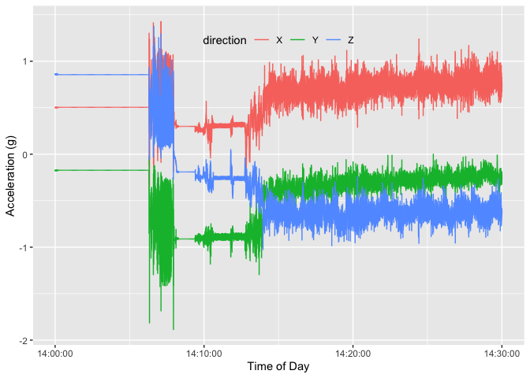
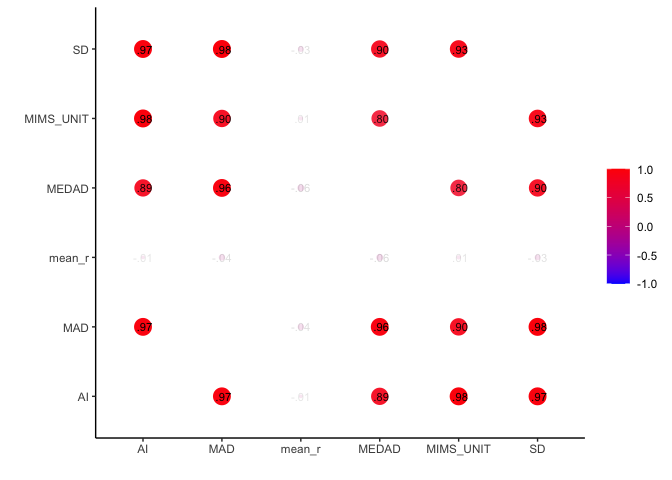
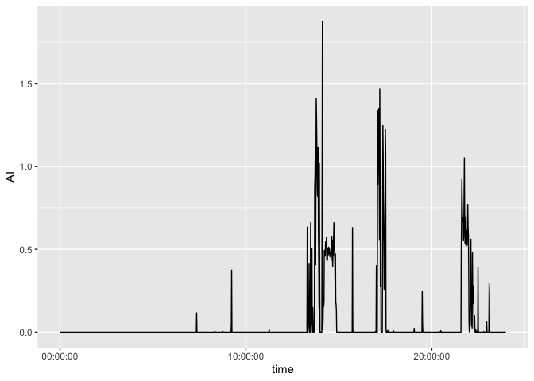

All code for this document is located at [here](https://raw.githubusercontent.com/muschellij2/osler/master/gt3x_limb_data/index.R).


# Goal
The goal of this work is to map out a fully reproducible analysis of accelerometer data with open source tools, including the R programming language.  The data we will be using is publicly-available, as are all the R packages.  We wish to use this as a foundational teaching tool for those who have data from wearable devices, specifically accelerometers.  We will use types of accelerometer from ActiGraph.  Though many other manufacturers of accelerometers exist, such as Axtivity, Actical, or Shimmer, and have their own data formats, ActiGraph is the most popular devices used in research-grade settings.  Many other commercial devices, such as Fitbit or Apple Watches, do not provide raw accelerations or provide them at a much lower frequency than research grade devices.

The analysis will be setup as follows: setting up the environment to be able to read an analyze the data, describing the data, reading in the data, performing data exploration, checking, and cleaning, creating data summaries, and then analyzing the difference in summaries across groups.

# Setup and Packages

We will be using a number of packages for this analysis.  We will use `dplyr`, `tidyr`, `readr` for data manipulation and input, `lubridate` to manipulate time (which is crucial with accelerometer data).  The `read.gt3x` package from https://github.com/THLfi/read.gt3x will allow us to read in `gt3x` files from ActiGraph.  The `AGread` package and `pygt3x` package can read in these files as well, but may have more limited functionality or are less mature, but are actively developed.  The `SummarizedActigraphy` (https://github.com/muschellij2/SummarizedActigraphy/) package is a wrapper for getting multiple accelerometry and wearable data types into a common data format.  `SummarizedActigraphy` is the least mature of all the packages discussed here.


```r
# remotes::install_github("muschellij2/SummarizedActigraphy")
library(SummarizedActigraphy)
# remotes::install_github("THLfi/read.gt3x")
library(read.gt3x)
library(dplyr)
library(readxl)
library(tidyr)
library(readr)
library(lubridate)
library(kableExtra)
library(corrr)
library(readxl)
library(ggplot2)
```

If you run into any issues loading any of these packages, you will likely need to run `install.packages` to install them.  The few that are on GitHub and not on the main R package repository (CRAN), need to be installed with the `remotes::install_github` function, requiring you to pass in the `user/repository` combination rather than simply the package name.

# Data

The data is from @chadwell_kenney_granat_thies_galpin_head_2019.  The data consists of 40 subjects, 20 with prostheses, 20 without.  Each wore tri-axial ActiGraph devices for 7 days, one on each arm.  Information about the handedness dominance, arm of prosthetic, and other demographic information was also released.   We will provide the demographics and clinical information related to this population below (in Section \@ref(demographics-data)).

The data is publicly-available through Figshare (https://figshare.com/).  The Figshare project for this data is located at https://springernature.figshare.com/collections/Upper_limb_activity_of_twenty_myoelectric_prosthesis_users_and_twenty_healthy_anatomically_intact_adults_/4457855. The gt3x data is located at https://springernature.figshare.com/articles/Unprocessed_raw_30Hz_acceleration_data_stored_as_gt3x/7946189.  This data consists of one directory of GT3X files.  In order to download them from this project, you need to download the whole data set.  As the data are licensed under [CC0](https://creativecommons.org/publicdomain/zero/1.0/), we have copied the to another Figshare location (https://figshare.com/articles/dataset/Raw_GT3X_Data_Duplicate/11916087), where each `gt3x` file has been renamed without spaces or parentheses, each file can be downloaded separately, and each `gt3x` file has been compressed for faster transfer and smaller storage footprint.


## Downloading the Data

As the data is publicly available, you do not need to do any authentication to download the data.  You do, however, need to either 1) go to the original repository and download the full data set, 2) go to the Figshare page for the separated data and get the links for the files or download them via a browser, or 3) use the `rfigshare` package to obtain all the links to the data [@rfigshare].  As we wish to perform a fully reproducible pipeline, we will download the data programmatically.  In most cases of research, the data will be stored locally or shared on a centralized place, such as a computing cluster.   


First, we create an output directory for the data, then we get the details from the Figshare API (application programming interface).  

We specify `data_dir` to be the directory where the data will be downloaded; we use the `here` package to specify paths relative to the project directory.


```r
data_dir = here::here("data")
```

The details we are interested in are the download URL and name of the file, so we can download them locally.  Note, the complete data set is over 2.5 gigabytes of storage.  If storage is an issue, you could download each individual file, process the data set into smaller summary measures, and then delete the downloaded data.  After the code is run, we write out the data set of information to cache it for future use.


```r
outfile = here::here("data", "file_info.rds")
if (!file.exists(outfile)) {
  x = rfigshare::fs_details("11916087", mine = FALSE, session = NULL)
  
  files = x$files
  files = lapply(files, function(x) {
    as.data.frame(x[c("download_url", "name", "id", "size")],
                  stringsAsFactors = FALSE)
  })
  all_files = dplyr::bind_rows(files)
  readr::write_rds(all_files, outfile)
} else {
  all_files = readr::read_rds(outfile)
}
```

The `all_files` data set is all the files from that Figshare repository, which includes the `gt3x` files and the metadata with demographics and behavioral data.  We will separate these out because they need to be read in differently:


```r
meta = all_files %>% 
  filter(grepl("Meta", name))
df = all_files %>% 
  filter(grepl("gt3x", name))
df %>% 
  head %>% 
  knitr::kable() %>% 
  kableExtra::kable_styling()
```

<table class="table" style="margin-left: auto; margin-right: auto;">
 <thead>
  <tr>
   <th style="text-align:left;"> download_url </th>
   <th style="text-align:left;"> name </th>
   <th style="text-align:right;"> id </th>
   <th style="text-align:left;"> size </th>
  </tr>
 </thead>
<tbody>
  <tr>
   <td style="text-align:left;"> https://ndownloader.figshare.com/files/21855555 </td>
   <td style="text-align:left;"> AI1_NEO1B41100255_2016-10-17.gt3x.gz </td>
   <td style="text-align:right;"> 21855555 </td>
   <td style="text-align:left;"> 33.59 MB </td>
  </tr>
  <tr>
   <td style="text-align:left;"> https://ndownloader.figshare.com/files/21855558 </td>
   <td style="text-align:left;"> AI1_NEO1F09120035_2016-10-17.gt3x.gz </td>
   <td style="text-align:right;"> 21855558 </td>
   <td style="text-align:left;"> 36.04 MB </td>
  </tr>
  <tr>
   <td style="text-align:left;"> https://ndownloader.figshare.com/files/21855561 </td>
   <td style="text-align:left;"> AI2_NEO1B41100262_2016-10-17.gt3x.gz </td>
   <td style="text-align:right;"> 21855561 </td>
   <td style="text-align:left;"> 39.84 MB </td>
  </tr>
  <tr>
   <td style="text-align:left;"> https://ndownloader.figshare.com/files/21855564 </td>
   <td style="text-align:left;"> AI2_NEO1F16120038_2016-10-17.gt3x.gz </td>
   <td style="text-align:right;"> 21855564 </td>
   <td style="text-align:left;"> 41.67 MB </td>
  </tr>
  <tr>
   <td style="text-align:left;"> https://ndownloader.figshare.com/files/21855567 </td>
   <td style="text-align:left;"> AI3_CLE2B21130054_2017-06-02.gt3x.gz </td>
   <td style="text-align:right;"> 21855567 </td>
   <td style="text-align:left;"> 46.45 MB </td>
  </tr>
  <tr>
   <td style="text-align:left;"> https://ndownloader.figshare.com/files/21855573 </td>
   <td style="text-align:left;"> AI3_CLE2B21130055_2017-06-02.gt3x.gz </td>
   <td style="text-align:right;"> 21855573 </td>
   <td style="text-align:left;"> 44.68 MB </td>
  </tr>
</tbody>
</table>

Below we are doing a series of data manipulations on the file name to create separate columns for the serial number, the identifier of the participant, the date of the start of recording.  We will then assign the group labels depending on the identifier of the participant. This process is standard data manipulation and does not pertain to accelerometry; we are using the popular `dplyr` package [@dplyr].  We will use this data set to download all the data into different sub-folders based on group.  The folder separation is not necessary as long as you have a table to map identifier to group status; this setup is simply a design choice.


```r
df = df %>% 
  rename(file = name) %>% 
  tidyr::separate(file, into = c("id", "serial", "date"), sep = "_",
                  remove = FALSE) %>% 
  mutate(date = sub(".gt3x.*", "", date)) %>% 
  mutate(date = lubridate::ymd(date)) %>% 
  mutate(group = ifelse(grepl("^PU", basename(file)), 
                        "group_with_prosthesis",
                        "group_without_prosthesis")) %>% 
  mutate(article_id = basename(download_url)) %>% 
  mutate(outfile = file.path(data_dir, group, basename(file)))
df %>% 
  head() %>% 
  knitr::kable() %>% 
  kableExtra::kable_styling()
```

<table class="table" style="margin-left: auto; margin-right: auto;">
 <thead>
  <tr>
   <th style="text-align:left;"> download_url </th>
   <th style="text-align:left;"> file </th>
   <th style="text-align:left;"> id </th>
   <th style="text-align:left;"> serial </th>
   <th style="text-align:left;"> date </th>
   <th style="text-align:left;"> size </th>
   <th style="text-align:left;"> group </th>
   <th style="text-align:left;"> article_id </th>
   <th style="text-align:left;"> outfile </th>
  </tr>
 </thead>
<tbody>
  <tr>
   <td style="text-align:left;"> https://ndownloader.figshare.com/files/21855555 </td>
   <td style="text-align:left;"> AI1_NEO1B41100255_2016-10-17.gt3x.gz </td>
   <td style="text-align:left;"> AI1 </td>
   <td style="text-align:left;"> NEO1B41100255 </td>
   <td style="text-align:left;"> 2016-10-17 </td>
   <td style="text-align:left;"> 33.59 MB </td>
   <td style="text-align:left;"> group_without_prosthesis </td>
   <td style="text-align:left;"> 21855555 </td>
   <td style="text-align:left;"> /Users/johnmuschelli/Dropbox/Projects/upper_limb_gt3x_prosthesis/data/group_without_prosthesis/AI1_NEO1B41100255_2016-10-17.gt3x.gz </td>
  </tr>
  <tr>
   <td style="text-align:left;"> https://ndownloader.figshare.com/files/21855558 </td>
   <td style="text-align:left;"> AI1_NEO1F09120035_2016-10-17.gt3x.gz </td>
   <td style="text-align:left;"> AI1 </td>
   <td style="text-align:left;"> NEO1F09120035 </td>
   <td style="text-align:left;"> 2016-10-17 </td>
   <td style="text-align:left;"> 36.04 MB </td>
   <td style="text-align:left;"> group_without_prosthesis </td>
   <td style="text-align:left;"> 21855558 </td>
   <td style="text-align:left;"> /Users/johnmuschelli/Dropbox/Projects/upper_limb_gt3x_prosthesis/data/group_without_prosthesis/AI1_NEO1F09120035_2016-10-17.gt3x.gz </td>
  </tr>
  <tr>
   <td style="text-align:left;"> https://ndownloader.figshare.com/files/21855561 </td>
   <td style="text-align:left;"> AI2_NEO1B41100262_2016-10-17.gt3x.gz </td>
   <td style="text-align:left;"> AI2 </td>
   <td style="text-align:left;"> NEO1B41100262 </td>
   <td style="text-align:left;"> 2016-10-17 </td>
   <td style="text-align:left;"> 39.84 MB </td>
   <td style="text-align:left;"> group_without_prosthesis </td>
   <td style="text-align:left;"> 21855561 </td>
   <td style="text-align:left;"> /Users/johnmuschelli/Dropbox/Projects/upper_limb_gt3x_prosthesis/data/group_without_prosthesis/AI2_NEO1B41100262_2016-10-17.gt3x.gz </td>
  </tr>
  <tr>
   <td style="text-align:left;"> https://ndownloader.figshare.com/files/21855564 </td>
   <td style="text-align:left;"> AI2_NEO1F16120038_2016-10-17.gt3x.gz </td>
   <td style="text-align:left;"> AI2 </td>
   <td style="text-align:left;"> NEO1F16120038 </td>
   <td style="text-align:left;"> 2016-10-17 </td>
   <td style="text-align:left;"> 41.67 MB </td>
   <td style="text-align:left;"> group_without_prosthesis </td>
   <td style="text-align:left;"> 21855564 </td>
   <td style="text-align:left;"> /Users/johnmuschelli/Dropbox/Projects/upper_limb_gt3x_prosthesis/data/group_without_prosthesis/AI2_NEO1F16120038_2016-10-17.gt3x.gz </td>
  </tr>
  <tr>
   <td style="text-align:left;"> https://ndownloader.figshare.com/files/21855567 </td>
   <td style="text-align:left;"> AI3_CLE2B21130054_2017-06-02.gt3x.gz </td>
   <td style="text-align:left;"> AI3 </td>
   <td style="text-align:left;"> CLE2B21130054 </td>
   <td style="text-align:left;"> 2017-06-02 </td>
   <td style="text-align:left;"> 46.45 MB </td>
   <td style="text-align:left;"> group_without_prosthesis </td>
   <td style="text-align:left;"> 21855567 </td>
   <td style="text-align:left;"> /Users/johnmuschelli/Dropbox/Projects/upper_limb_gt3x_prosthesis/data/group_without_prosthesis/AI3_CLE2B21130054_2017-06-02.gt3x.gz </td>
  </tr>
  <tr>
   <td style="text-align:left;"> https://ndownloader.figshare.com/files/21855573 </td>
   <td style="text-align:left;"> AI3_CLE2B21130055_2017-06-02.gt3x.gz </td>
   <td style="text-align:left;"> AI3 </td>
   <td style="text-align:left;"> CLE2B21130055 </td>
   <td style="text-align:left;"> 2017-06-02 </td>
   <td style="text-align:left;"> 44.68 MB </td>
   <td style="text-align:left;"> group_without_prosthesis </td>
   <td style="text-align:left;"> 21855573 </td>
   <td style="text-align:left;"> /Users/johnmuschelli/Dropbox/Projects/upper_limb_gt3x_prosthesis/data/group_without_prosthesis/AI3_CLE2B21130055_2017-06-02.gt3x.gz </td>
  </tr>
</tbody>
</table>

The following will download all the files to their respective directories (separated by prosthetic group).  Again, see the note above about the size of the full data.  We present code below to download all the files, but later we will dynamically download one file to perform data exploration.


```r
# run only those where data doesn't exist
run_df = df %>% 
  filter(!file.exists(outfile))
for (iid in seq(nrow(run_df))) {
  idf = run_df[iid, ]
  out = curl::curl_download(idf$download_url, destfile = idf$outfile)
}
```

## Demographics data

Although we could create summaries and estimate differences by groups on accelerometry measures, we may want to adjust for other factors which may affect measures of activity, such as sex, age, body mass index (BMI), or if the device is on the dominant limb, if available.  Additionally, when analyzing those with prosthetics, information about the prosthetic or information about the length of use may be relevant.  The metadata with participant information is an `xlsx` file, so we will read it in using the `readxl` package.  You can also open this file in Excel and output it to a CSV file, but we do not recommend that as some formatting can change and we recommend against making intermediate files such as this if you can read in the raw data.  


```r
metadata = file.path(data_dir, "Metadata.xlsx")
if (!file.exists(metadata)) {
  out = download.file(meta$download_url, destfile = metadata)
}
meta = readxl::read_excel(metadata)
head(meta)
```

```
# A tibble: 6 x 20
  `Participant Id… Gender Age   `Absence side (… ...5  `Right Sensor`
  <chr>            <chr>  <chr> <chr>            <chr> <chr>         
1 <NA>             <NA>   <NA>  <NA>             <NA>  <NA>          
2 <NA>             <NA>   <NA>  <NA>             Sens… <NA>          
3 PU1              M      45    R                GT3X+ NEO1F16120038 
4 PU2              M      44    L                GT3X+ NEO1B41100262 
5 PU3              M      56    R                wGT3… CLE2B21130054 
6 PU4              M      61    R*               GT3X+ NEO1F09120034 
# … with 14 more variables: `Left Sensor` <chr>, `Time since limb loss
#   (years)` <chr>, `Time since prescription of a myoelectric prosthesis
#   (years)` <dbl>, Data <chr>, ...11 <chr>, ...12 <chr>, ...13 <chr>,
#   ...14 <chr>, ...15 <chr>, ...16 <chr>, ...17 <chr>, ...18 <chr>,
#   ...19 <chr>, ...20 <chr>
```

In this instance there are blank columns, which are given a naming convention with 2 periods (`..`) in front, we are simply making these columns `NA` and they will be discarded.


```r
bad_col = grepl("^\\.\\.", colnames(meta))
colnames(meta)[bad_col] = NA
```

Also, as with many `xlsx` files, the first row may be the column identifier (it is in this case, but not always), but there may be additional sub-headers or merged cells before there is data.  Here, the first 2 rows are extra cells that need to be deleted, as well as some columns where the true column name is in one of the other rows than the first.  After some manipulation, each column should now have name that reflects the data in it:


```r
potential_headers = rbind(colnames(meta), meta[1:2, ])
potential_headers = apply(potential_headers, 2, function(x) {
  x = paste(na.omit(x), collapse = "")
  x = sub(" .csv", ".csv", x)
  x = sub(" .wav", ".wav", x)
  x = gsub(" ", "_", x)
  x
})
colnames(meta) = potential_headers
meta = meta[-c(1:2),]
colnames(meta)
```

```
 [1] "Participant_Identifier"                                     
 [2] "Gender"                                                     
 [3] "Age"                                                        
 [4] "Absence_side_(*previously_dominant)"                        
 [5] "Sensor_type"                                                
 [6] "Right_Sensor"                                               
 [7] "Left_Sensor"                                                
 [8] "Time_since_limb_loss_(years)"                               
 [9] "Time_since_prescription_of_a_myoelectric_prosthesis_(years)"
[10] "DataRAW_.gt3x"                                              
[11] "RAW.csv"                                                    
[12] "RAW.wav"                                                    
[13] "Without_Low_Frequency_Extension60s.csv"                     
[14] "1s.csv"                                                     
[15] "With_Low_Frequency_Extension60sLFE.csv"                     
[16] "1sLFE.csv"                                                  
[17] "Wear_data.csv"                                              
[18] "Sleep_diary.csv"                                            
[19] "Prosthesis_Wear_Diary.csv"                                  
[20] "Sensor_Wear_Diary.csv"                                      
```

In the Figshare project, the group from @chadwell_kenney_granat_thies_galpin_head_2019 uploaded multiple intermediate and ancillary files to provide varying levels of information for different audiences.  Some of this information included raw acceleration files (which we are replicate using `.gt3x` files), wear diaries, and 1-second summaries.  These columns in the `meta` object indicate if those files exist for that participant.

Here we are going to rename a column to `id` to harmonize it with the data from the `gt3x` files, recoding some non-ASCII characters, making some variables numeric, and inferring some values from group status:


```r
meta = meta %>% 
  rename(id = Participant_Identifier)
meta = meta %>% 
  filter(!is.na(id),
         id != "Participant Identifier") %>% 
  mutate_all(.funs = function(x) gsub("ü", "yes", x))
meta = meta %>% 
  mutate_at(
    .vars = vars(
      Age,
      `Time_since_prescription_of_a_myoelectric_prosthesis_(years)`
    ),
    readr::parse_number
  ) 
meta = meta %>% 
  mutate( `Time_since_limb_loss_(years)` = ifelse(
    `Time_since_limb_loss_(years)` == "Congenital", 0,
    `Time_since_limb_loss_(years)`)
  )
meta %>% 
  head %>% 
  knitr::kable() %>% 
  kableExtra::kable_styling()
```

<table class="table" style="margin-left: auto; margin-right: auto;">
 <thead>
  <tr>
   <th style="text-align:left;"> id </th>
   <th style="text-align:left;"> Gender </th>
   <th style="text-align:right;"> Age </th>
   <th style="text-align:left;"> Absence_side_(*previously_dominant) </th>
   <th style="text-align:left;"> Sensor_type </th>
   <th style="text-align:left;"> Right_Sensor </th>
   <th style="text-align:left;"> Left_Sensor </th>
   <th style="text-align:left;"> Time_since_limb_loss_(years) </th>
   <th style="text-align:right;"> Time_since_prescription_of_a_myoelectric_prosthesis_(years) </th>
   <th style="text-align:left;"> DataRAW_.gt3x </th>
   <th style="text-align:left;"> RAW.csv </th>
   <th style="text-align:left;"> RAW.wav </th>
   <th style="text-align:left;"> Without_Low_Frequency_Extension60s.csv </th>
   <th style="text-align:left;"> 1s.csv </th>
   <th style="text-align:left;"> With_Low_Frequency_Extension60sLFE.csv </th>
   <th style="text-align:left;"> 1sLFE.csv </th>
   <th style="text-align:left;"> Wear_data.csv </th>
   <th style="text-align:left;"> Sleep_diary.csv </th>
   <th style="text-align:left;"> Prosthesis_Wear_Diary.csv </th>
   <th style="text-align:left;"> Sensor_Wear_Diary.csv </th>
  </tr>
 </thead>
<tbody>
  <tr>
   <td style="text-align:left;"> PU1 </td>
   <td style="text-align:left;"> M </td>
   <td style="text-align:right;"> 45 </td>
   <td style="text-align:left;"> R </td>
   <td style="text-align:left;"> GT3X+ </td>
   <td style="text-align:left;"> NEO1F16120038 </td>
   <td style="text-align:left;"> NEO1F09120035 </td>
   <td style="text-align:left;"> 0 </td>
   <td style="text-align:right;"> 1.5 </td>
   <td style="text-align:left;"> yes </td>
   <td style="text-align:left;"> yes </td>
   <td style="text-align:left;"> yes </td>
   <td style="text-align:left;"> yes </td>
   <td style="text-align:left;"> yes </td>
   <td style="text-align:left;"> yes </td>
   <td style="text-align:left;"> yes </td>
   <td style="text-align:left;"> yes </td>
   <td style="text-align:left;"> yes </td>
   <td style="text-align:left;"> yes </td>
   <td style="text-align:left;"> yes </td>
  </tr>
  <tr>
   <td style="text-align:left;"> PU2 </td>
   <td style="text-align:left;"> M </td>
   <td style="text-align:right;"> 44 </td>
   <td style="text-align:left;"> L </td>
   <td style="text-align:left;"> GT3X+ </td>
   <td style="text-align:left;"> NEO1B41100262 </td>
   <td style="text-align:left;"> NEO1B41100255 </td>
   <td style="text-align:left;"> 0 </td>
   <td style="text-align:right;"> 35.0 </td>
   <td style="text-align:left;"> yes </td>
   <td style="text-align:left;"> yes </td>
   <td style="text-align:left;"> yes </td>
   <td style="text-align:left;"> yes </td>
   <td style="text-align:left;"> yes </td>
   <td style="text-align:left;"> yes </td>
   <td style="text-align:left;"> yes </td>
   <td style="text-align:left;"> yes </td>
   <td style="text-align:left;"> yes </td>
   <td style="text-align:left;"> yes </td>
   <td style="text-align:left;"> yes </td>
  </tr>
  <tr>
   <td style="text-align:left;"> PU3 </td>
   <td style="text-align:left;"> M </td>
   <td style="text-align:right;"> 56 </td>
   <td style="text-align:left;"> R </td>
   <td style="text-align:left;"> wGT3X+ </td>
   <td style="text-align:left;"> CLE2B21130054 </td>
   <td style="text-align:left;"> CLE2B21130055 </td>
   <td style="text-align:left;"> 22 </td>
   <td style="text-align:right;"> 17.0 </td>
   <td style="text-align:left;"> yes </td>
   <td style="text-align:left;"> yes </td>
   <td style="text-align:left;"> yes </td>
   <td style="text-align:left;"> yes </td>
   <td style="text-align:left;"> yes </td>
   <td style="text-align:left;"> yes </td>
   <td style="text-align:left;"> yes </td>
   <td style="text-align:left;"> yes </td>
   <td style="text-align:left;"> yes </td>
   <td style="text-align:left;"> yes </td>
   <td style="text-align:left;"> yes </td>
  </tr>
  <tr>
   <td style="text-align:left;"> PU4 </td>
   <td style="text-align:left;"> M </td>
   <td style="text-align:right;"> 61 </td>
   <td style="text-align:left;"> R* </td>
   <td style="text-align:left;"> GT3X+ </td>
   <td style="text-align:left;"> NEO1F09120034 </td>
   <td style="text-align:left;"> NEO1B41100262 </td>
   <td style="text-align:left;"> 37 </td>
   <td style="text-align:right;"> 28.0 </td>
   <td style="text-align:left;"> yes </td>
   <td style="text-align:left;"> yes </td>
   <td style="text-align:left;"> yes </td>
   <td style="text-align:left;"> yes </td>
   <td style="text-align:left;"> yes </td>
   <td style="text-align:left;"> yes </td>
   <td style="text-align:left;"> yes </td>
   <td style="text-align:left;"> yes </td>
   <td style="text-align:left;"> yes </td>
   <td style="text-align:left;"> yes </td>
   <td style="text-align:left;"> Incomplete </td>
  </tr>
  <tr>
   <td style="text-align:left;"> PU5 </td>
   <td style="text-align:left;"> F </td>
   <td style="text-align:right;"> 18 </td>
   <td style="text-align:left;"> L </td>
   <td style="text-align:left;"> GT3X+ </td>
   <td style="text-align:left;"> NEO1F16120038 </td>
   <td style="text-align:left;"> NEO1F09120035 </td>
   <td style="text-align:left;"> 0 </td>
   <td style="text-align:right;"> 10.0 </td>
   <td style="text-align:left;"> yes </td>
   <td style="text-align:left;"> yes </td>
   <td style="text-align:left;"> yes </td>
   <td style="text-align:left;"> yes </td>
   <td style="text-align:left;"> yes </td>
   <td style="text-align:left;"> yes </td>
   <td style="text-align:left;"> yes </td>
   <td style="text-align:left;"> yes </td>
   <td style="text-align:left;"> Incomplete </td>
   <td style="text-align:left;"> Incomplete </td>
   <td style="text-align:left;"> yes </td>
  </tr>
  <tr>
   <td style="text-align:left;"> PU6 </td>
   <td style="text-align:left;"> M </td>
   <td style="text-align:right;"> 51 </td>
   <td style="text-align:left;"> L </td>
   <td style="text-align:left;"> wGT3X+ </td>
   <td style="text-align:left;"> CLE2B21130054 </td>
   <td style="text-align:left;"> CLE2B21130055 </td>
   <td style="text-align:left;"> 0 </td>
   <td style="text-align:right;"> 30.0 </td>
   <td style="text-align:left;"> yes </td>
   <td style="text-align:left;"> yes </td>
   <td style="text-align:left;"> yes </td>
   <td style="text-align:left;"> yes </td>
   <td style="text-align:left;"> yes </td>
   <td style="text-align:left;"> yes </td>
   <td style="text-align:left;"> yes </td>
   <td style="text-align:left;"> yes </td>
   <td style="text-align:left;"> yes </td>
   <td style="text-align:left;"> yes </td>
   <td style="text-align:left;"> Incomplete </td>
  </tr>
</tbody>
</table>

We now have all data downloaded and the clinical or demographic information provided with the study.  We can then show how to read the raw `gt3x` files.

We can now merge the demographic and clinical data with the file data set to have one data set to use throughout the analysis: 

```r
meta = meta %>% 
  dplyr::select(id, Gender, Age, `Absence_side_(*previously_dominant)`,
         Sensor_type, Right_Sensor, Left_Sensor, 
         `Time_since_limb_loss_(years)`, 
         `Time_since_prescription_of_a_myoelectric_prosthesis_(years)`)
meta = meta %>% 
  tidyr::gather(side, serial, Right_Sensor, Left_Sensor) %>% 
  mutate(side = sub("_Sensor", "", side))
df = full_join(meta, df)
```


# Reading in GT3X files

## Discussion of Package Options

THe `read.gt3x`, `AGread`, and `pygt3x` R packages can read gt3x files, but only `read.gt3x` and `pygt3x` packages can read in the old GT3X format from NHANES 2003-2006.  As `read.gt3x` is more mature and more thoroughly checked, we will use that package to read the `gt3x` format.  *Note, if you are using Python, the `gt3x` module can be used, which is the backbone for the `pygt3x` R package, which the author has helped develop).  If you need additional information, such as temperature, light information (referred to as Lux), etc, you may want to try `AGread::read_gt3x`.  Additionally, these packages can read in `gt3x` files that have been zipped, including gzipped (extension `gz`), bzipped (`bz2`), or xzipped (`xz`).

THe `SummarizedActigraphy::read_actigraphy` wraps the `read.gt3x` functionality, and puts the output format to the `AccData` format, which is common in the `GGIR` package [@GGIR], a popular analysis R package for accelerometer analysis.  The `read_actigraphy` also tries to read other formats, by using `GGIR::g.readaccfile` and other `GGIR` functionality.  


## Reading in one file

Here we will read in one file.  Though the above code downloaded all the files, this code can be used if you do not want to download the whole data set and explore one file at a time.


```r
# set.seed(20200804)
# iid = sample(nrow(df), 1)
iid = 7
idf = df[iid, ]
print(idf$id)
```

```
[1] "PU7"
```

```r
gt3x_file = idf$outfile
if (!file.exists(gt3x_file)) {
  out = curl::curl_download(idf$download_url, destfile = gt3x_file)
}
id = idf$id
serial = idf$serial
```

Once the data is downloaded, you can read the file in using `read.gt3x`:

```r
gt3x_acc = read.gt3x(gt3x_file, verbose = FALSE,
                asDataFrame = TRUE, imputeZeroes = TRUE)
gt3x_acc
```

```
Sampling Rate: 30Hz
Firmware Version: 3.2.1
Serial Number Prefix: NEO
      X      Y     Z                time
1 0.499 -0.176 0.856 2017-05-09 14:00:00
2 0.501 -0.173 0.856 2017-05-09 14:00:00
3 0.504 -0.173 0.856 2017-05-09 14:00:00
4 0.499 -0.176 0.856 2017-05-09 14:00:00
5 0.501 -0.173 0.862 2017-05-09 14:00:00
6 0.501 -0.173 0.856 2017-05-09 14:00:00
```

We see some information about the firmware, serial number, sampling rate/frequency, and the data: acceleration in gravity units ($g$) and the time of measurement.  As the sampling rate for this file is 30, there are 30 measurements per second.  So, if you look at the `time` column, we see the time "repeated", but it's truly not the case.  The milliseconds are truly in there, but you need to change your settings to see them:


```r
options(digits.secs = 2)
gt3x_acc
```

```
Sampling Rate: 30Hz
Firmware Version: 3.2.1
Serial Number Prefix: NEO
      X      Y     Z                   time
1 0.499 -0.176 0.856 2017-05-09 14:00:00.00
2 0.501 -0.173 0.856 2017-05-09 14:00:00.02
3 0.504 -0.173 0.856 2017-05-09 14:00:00.06
4 0.499 -0.176 0.856 2017-05-09 14:00:00.09
5 0.501 -0.173 0.862 2017-05-09 14:00:00.13
6 0.501 -0.173 0.856 2017-05-09 14:00:00.17
```

We will show later, but functions from the `lubridate` package are immensely useful for manipulations of time variables; we will use the `floor_date` function to group all measurements within the same second together [@lubridate].   

Additional information, such as the header information can be found by extracting the attributes:


```r
at = attributes(gt3x_acc)
names(at)
```

```
 [1] "names"            "row.names"        "class"            "subject_name"    
 [5] "time_zone"        "missingness"      "old_version"      "firmware"        
 [9] "last_sample_time" "serial_prefix"    "sample_rate"      "header"          
[13] "start_time"       "stop_time"        "total_records"    "bad_samples"     
```

```r
at$header
```

```
GT3X information
 $ Serial Number     :"NEO1B41100262"
 $ Device Type       :"GT3XPlus"
 $ Firmware          :"3.2.1"
 $ Battery Voltage   :"4.19"
 $ Sample Rate       :30
 $ Start Date        : POSIXct, format: "2017-05-09 14:00:00"
 $ Stop Date         : POSIXct, format: "2017-05-16 14:00:00"
 $ Last Sample Time  : POSIXct, format: "2017-05-16 14:00:00"
 $ TimeZone          :"01:00:00"
 $ Download Date     : POSIXct, format: "2017-05-17 12:05:23"
 $ Board Revision    :"1"
 $ Unexpected Resets :"0"
 $ Acceleration Scale:341
 $ Acceleration Min  :"-6.0"
 $ Acceleration Max  :"6.0"
 $ Sex               :"Female"
 $ Limb              :"Wrist"
 $ Side              :"Right"
 $ Dominance         :"Non-Dominant"
 $ Subject Name      :"P05"
 $ Serial Prefix     :"NEO"
```


Again, to harmonize the data output format (if different device manufacturers are aggregated), we will use `read_actigraphy`, which uses `read.gt3x`, but makes a different format, which is a list of values.  This design choice is that information such as the header are explicitly codified as opposed to attributes, which can be implicitly removed depending on the operation.  


```r
acc = read_actigraphy(idf$outfile, verbose = FALSE)
head(acc$data.out)
```

```
Sampling Rate: 30Hz
Firmware Version: 3.2.1
Serial Number Prefix: NEO
      X      Y     Z                   time
1 0.499 -0.176 0.856 2017-05-09 14:00:00.00
2 0.501 -0.173 0.856 2017-05-09 14:00:00.02
3 0.504 -0.173 0.856 2017-05-09 14:00:00.06
4 0.499 -0.176 0.856 2017-05-09 14:00:00.09
5 0.501 -0.173 0.862 2017-05-09 14:00:00.13
6 0.501 -0.173 0.856 2017-05-09 14:00:00.17
```

```r
acc$freq # sample rate
```

```
[1] 30
```

```r
acc$header
```

```
# A tibble: 21 x 2
   Field            Value              
   <chr>            <chr>              
 1 Serial Number    NEO1B41100262      
 2 Device Type      GT3XPlus           
 3 Firmware         3.2.1              
 4 Battery Voltage  4.19               
 5 Sample Rate      30                 
 6 Start Date       2017-05-09 14:00:00
 7 Stop Date        2017-05-16 14:00:00
 8 Last Sample Time 2017-05-16 14:00:00
 9 TimeZone         01:00:00           
10 Download Date    2017-05-17 12:05:23
# … with 11 more rows
```

Let's look at the number of measurements per second to ensure the reported sampling rate is the true sampling rate:


```r
res = acc$data.out %>% 
  mutate(dt = floor_date(time, "seconds")) %>% 
  group_by(dt) %>% 
  count()
table(res$n)
```

```

    30 
604800 
```

```r
all(res$n == acc$freq)
```

```
[1] TRUE
```

Thus, we see that the sampling rate is indeed represented accurately in the data.  Note, in some instances, the last second may not have full data, which can be checked using the `tail` of `acc$data.out`.


## What is a GT3X file?

**This section is important about removing potential participant identifiers when sharing data**.

At its core, a `.gt3x` file is simply a zip file.  You can unzip a `.gt3x` with any of the standard ways you'd extract a `.zip` file.  In some systems, it may not allow you to do this.  You should rename the `.gt3x` file to `.zip` and then you should be able to extract it.  Note, if the file name is `.gt3x.gz` then you have g-unzip the file first.  Even though we use "GT3X" generally, there are actually 2 different ways the data was stored, one referred to as the "old" format or the NHANES format.  The other format is generally referred to as a GT3X format or new format, but these semantics are not univeral.  

Here we can show the steps of g-unzipping the `.gt3x` file, then running `unzip` to show the package contents. We will do everything in the temporary directory, as we will not need these files in this analysis because they already were extracted using functions to read in `.gt3x` files.


```r
output = R.utils::gunzip(gt3x_file, remove = FALSE, temporary = TRUE, overwrite = TRUE)
print(output)
```

```
[1] "/var/folders/1s/wrtqcpxn685_zk570bnx9_rr0000gr/T/RtmptKYOqM/PU7_NEO1B41100262_2017-05-09.gt3x"
attr(,"nbrOfBytes")
[1] 2544901
```

```r
out = unzip(output, exdir = tempdir())
print(out)
```

```
[1] "/var/folders/1s/wrtqcpxn685_zk570bnx9_rr0000gr/T//RtmptKYOqM/log.bin"   
[2] "/var/folders/1s/wrtqcpxn685_zk570bnx9_rr0000gr/T//RtmptKYOqM/eeprom.bin"
[3] "/var/folders/1s/wrtqcpxn685_zk570bnx9_rr0000gr/T//RtmptKYOqM/info.txt"  
```

In the "new" format, we see only 2 files, `info.txt`, which holds the metadata/header information and `log.bin`, which holds the "data".  In the older NHANES format, `info.txt` is still present, but the different types of data (activity, light, battery, etc.) are in separate files and the main file for activity is `actviity.bin`. 

If you want more information on the technical details on how the `.gt3x` format is read in, please visit https://github.com/actigraph/NHANES-GT3X-File-Format and https://github.com/actigraph/GT3X-File-Format.


## Comparison to a CSV

The group from @chadwell_kenney_granat_thies_galpin_head_2019 also uploaded the raw CSV files from ActiGraph's ActiLife software, which can be used to check to make sure our open-source software has read the data in correctly.  We will assume the output from ActiLife is the "gold standard".  

Similarly to the GT3X data set, the CSV files are given as [one directory of all data](https://springernature.figshare.com/articles/dataset/Unprocessed_raw_30Hz_acceleration_data_stored_as_csv/7946186) and we have separated them into [individual gzipped CSV files](https://figshare.com/articles/dataset/RAW_CSV_from_GT3X_Duplicate/12883463).  We will perform the same operation as above, but not download all the data as it essentially is the same size as the GT3X data.  We will download the data as needed to perform a comparison.


```r
x = rfigshare::fs_details("12883463", mine = FALSE, session = NULL)
files = x$files
files = lapply(files, function(x) {
  as.data.frame(x[c("download_url", "name", "id", "size")],
                stringsAsFactors = FALSE)
})
csv_df = dplyr::bind_rows(files)
csv_df = csv_df %>% 
  rename(file = name) %>% 
  tidyr::separate(file, into = c("id", "serial", "date"), sep = "_",
                  remove = FALSE) %>% 
  mutate(date = sub(".csv.*", "", date)) %>% 
  mutate(date = lubridate::ymd(date)) %>% 
  mutate(group = ifelse(grepl("^PU", basename(file)), 
                        "group_with_prosthesis",
                        "group_without_prosthesis")) %>% 
  mutate(article_id = basename(download_url)) %>% 
  mutate(outfile = file.path(data_dir, group, basename(file)))
csv_df %>% 
  head %>% 
  knitr::kable() %>% 
  kableExtra::kable_styling()
```

<table class="table" style="margin-left: auto; margin-right: auto;">
 <thead>
  <tr>
   <th style="text-align:left;"> download_url </th>
   <th style="text-align:left;"> file </th>
   <th style="text-align:left;"> id </th>
   <th style="text-align:left;"> serial </th>
   <th style="text-align:left;"> date </th>
   <th style="text-align:left;"> size </th>
   <th style="text-align:left;"> group </th>
   <th style="text-align:left;"> article_id </th>
   <th style="text-align:left;"> outfile </th>
  </tr>
 </thead>
<tbody>
  <tr>
   <td style="text-align:left;"> https://ndownloader.figshare.com/files/24488300 </td>
   <td style="text-align:left;"> AI1_NEO1B41100255_2016-10-17.csv.gz </td>
   <td style="text-align:left;"> AI1 </td>
   <td style="text-align:left;"> NEO1B41100255 </td>
   <td style="text-align:left;"> 2016-10-17 </td>
   <td style="text-align:left;"> 41.62 MB </td>
   <td style="text-align:left;"> group_without_prosthesis </td>
   <td style="text-align:left;"> 24488300 </td>
   <td style="text-align:left;"> /Users/johnmuschelli/Dropbox/Projects/upper_limb_gt3x_prosthesis/data/group_without_prosthesis/AI1_NEO1B41100255_2016-10-17.csv.gz </td>
  </tr>
  <tr>
   <td style="text-align:left;"> https://ndownloader.figshare.com/files/24488303 </td>
   <td style="text-align:left;"> AI1_NEO1F09120035_2016-10-17.csv.gz </td>
   <td style="text-align:left;"> AI1 </td>
   <td style="text-align:left;"> NEO1F09120035 </td>
   <td style="text-align:left;"> 2016-10-17 </td>
   <td style="text-align:left;"> 44.01 MB </td>
   <td style="text-align:left;"> group_without_prosthesis </td>
   <td style="text-align:left;"> 24488303 </td>
   <td style="text-align:left;"> /Users/johnmuschelli/Dropbox/Projects/upper_limb_gt3x_prosthesis/data/group_without_prosthesis/AI1_NEO1F09120035_2016-10-17.csv.gz </td>
  </tr>
  <tr>
   <td style="text-align:left;"> https://ndownloader.figshare.com/files/24488309 </td>
   <td style="text-align:left;"> AI2_NEO1B41100262_2016-10-17.csv.gz </td>
   <td style="text-align:left;"> AI2 </td>
   <td style="text-align:left;"> NEO1B41100262 </td>
   <td style="text-align:left;"> 2016-10-17 </td>
   <td style="text-align:left;"> 48.68 MB </td>
   <td style="text-align:left;"> group_without_prosthesis </td>
   <td style="text-align:left;"> 24488309 </td>
   <td style="text-align:left;"> /Users/johnmuschelli/Dropbox/Projects/upper_limb_gt3x_prosthesis/data/group_without_prosthesis/AI2_NEO1B41100262_2016-10-17.csv.gz </td>
  </tr>
  <tr>
   <td style="text-align:left;"> https://ndownloader.figshare.com/files/24488312 </td>
   <td style="text-align:left;"> AI2_NEO1F16120038_2016-10-17.csv.gz </td>
   <td style="text-align:left;"> AI2 </td>
   <td style="text-align:left;"> NEO1F16120038 </td>
   <td style="text-align:left;"> 2016-10-17 </td>
   <td style="text-align:left;"> 51.64 MB </td>
   <td style="text-align:left;"> group_without_prosthesis </td>
   <td style="text-align:left;"> 24488312 </td>
   <td style="text-align:left;"> /Users/johnmuschelli/Dropbox/Projects/upper_limb_gt3x_prosthesis/data/group_without_prosthesis/AI2_NEO1F16120038_2016-10-17.csv.gz </td>
  </tr>
  <tr>
   <td style="text-align:left;"> https://ndownloader.figshare.com/files/24488315 </td>
   <td style="text-align:left;"> AI3_CLE2B21130054_2017-06-02.csv.gz </td>
   <td style="text-align:left;"> AI3 </td>
   <td style="text-align:left;"> CLE2B21130054 </td>
   <td style="text-align:left;"> 2017-06-02 </td>
   <td style="text-align:left;"> 53.38 MB </td>
   <td style="text-align:left;"> group_without_prosthesis </td>
   <td style="text-align:left;"> 24488315 </td>
   <td style="text-align:left;"> /Users/johnmuschelli/Dropbox/Projects/upper_limb_gt3x_prosthesis/data/group_without_prosthesis/AI3_CLE2B21130054_2017-06-02.csv.gz </td>
  </tr>
  <tr>
   <td style="text-align:left;"> https://ndownloader.figshare.com/files/24488318 </td>
   <td style="text-align:left;"> AI3_CLE2B21130055_2017-06-02.csv.gz </td>
   <td style="text-align:left;"> AI3 </td>
   <td style="text-align:left;"> CLE2B21130055 </td>
   <td style="text-align:left;"> 2017-06-02 </td>
   <td style="text-align:left;"> 51.28 MB </td>
   <td style="text-align:left;"> group_without_prosthesis </td>
   <td style="text-align:left;"> 24488318 </td>
   <td style="text-align:left;"> /Users/johnmuschelli/Dropbox/Projects/upper_limb_gt3x_prosthesis/data/group_without_prosthesis/AI3_CLE2B21130055_2017-06-02.csv.gz </td>
  </tr>
</tbody>
</table>


Again, if you wish to download all the data, you can run the following code:


```r
# run only those where data doesn't exist
run_df = csv_df %>% 
  filter(!file.exists(outfile))
for (iid in seq(nrow(run_df))) {
  idf = run_df[iid, ]
  out = curl::curl_download(idf$download_url, destfile = idf$outfile, quiet = FALSE)
}
```

Here we will extract the same ID and serial number that corresponds to the GT3X data.  The ID and serial together imply a unique identifier, as each participant wore 2 different accelerometers.  You should not assume that data from the right side and left side give the same or even similar values, especially depending on side dominance.  This data allows for that comparison, but we will not present that here.


```r
# run only those where data doesn't exist
idf_csv = csv_df %>% 
  filter(id %in% idf$id, serial %in% idf$serial)
stopifnot(nrow(idf_csv) == 1)
csv_file = idf_csv$outfile
if (!file.exists(csv_file)) {
  out = curl::curl_download(idf_csv$download_url, destfile = csv_file, quiet = FALSE)
}
```

The CSV output from ActiLife is a CSV with the accelerometer, battery, and light data.  The CSV file, however, has a header of the first 10 lines:


```r
readLines(csv_file, n = 11)
```

```
 [1] "------------ Data File Created By ActiGraph GT3X+ ActiLife v6.11.9 Firmware v3.2.1 date format dd/MM/yyyy at 30 Hz  Filter Normal -----------"
 [2] "Serial Number: NEO1B41100262"                                                                                                                 
 [3] "Start Time 14:00:00"                                                                                                                          
 [4] "Start Date 09/05/2017"                                                                                                                        
 [5] "Epoch Period (hh:mm:ss) 00:00:00"                                                                                                             
 [6] "Download Time 12:05:23"                                                                                                                       
 [7] "Download Date 17/05/2017"                                                                                                                     
 [8] "Current Memory Address: 0"                                                                                                                    
 [9] "Current Battery Voltage: 4.19     Mode = 12"                                                                                                  
[10] "--------------------------------------------------"                                                                                           
[11] "Accelerometer X,Accelerometer Y,Accelerometer Z"                                                                                              
```

Multiple packages have implemented ways to read in the file.  For example, `AGread::read_AG_raw` will read in the data, but will perform processing and data aggregation.  THe `GGIR::read.myacc.csv` function will read a CSV, but has a number of options, which can be overwhelming.  The `SummarizedActigraphy::read_acc_csv` is a function that wraps the functionality of `readr::read_csv` and gives the raw output back.  We will make the output data a `tibble` for printing purposes:


```r
csv = SummarizedActigraphy::read_acc_csv(csv_file, progress = FALSE)
csv$data = tibble::as_tibble(csv$data)
csv[c("header", "data")]
```

```
$header
 [1] "------------ Data File Created By ActiGraph GT3X+ ActiLife v6.11.9 Firmware v3.2.1 date format dd/MM/yyyy at 30 Hz  Filter Normal -----------"
 [2] "Serial Number: NEO1B41100262"                                                                                                                 
 [3] "Start Time 14:00:00"                                                                                                                          
 [4] "Start Date 09/05/2017"                                                                                                                        
 [5] "Epoch Period (hh:mm:ss) 00:00:00"                                                                                                             
 [6] "Download Time 12:05:23"                                                                                                                       
 [7] "Download Date 17/05/2017"                                                                                                                     
 [8] "Current Memory Address: 0"                                                                                                                    
 [9] "Current Battery Voltage: 4.19     Mode = 12"                                                                                                  
[10] "--------------------------------------------------"                                                                                           

$data
# A tibble: 18,144,000 x 4
   time                    X      Y     Z
   <dttm>              <dbl>  <dbl> <dbl>
 1 2017-05-09 14:00:00 0.499 -0.176 0.856
 2 2017-05-09 14:00:00 0.501 -0.173 0.856
 3 2017-05-09 14:00:00 0.504 -0.173 0.856
 4 2017-05-09 14:00:00 0.499 -0.176 0.856
 5 2017-05-09 14:00:00 0.501 -0.173 0.862
 6 2017-05-09 14:00:00 0.501 -0.173 0.856
 7 2017-05-09 14:00:00 0.499 -0.173 0.862
 8 2017-05-09 14:00:00 0.501 -0.173 0.862
 9 2017-05-09 14:00:00 0.504 -0.176 0.862
10 2017-05-09 14:00:00 0.501 -0.17  0.856
# … with 18,143,990 more rows
```
We see the information from what ActiGraph software version created the file, as well as information pertinent to the GT3X+ device.  We can compare this information from the header from the `.gt3x` file:


```r
acc$header
```

```
# A tibble: 21 x 2
   Field            Value              
   <chr>            <chr>              
 1 Serial Number    NEO1B41100262      
 2 Device Type      GT3XPlus           
 3 Firmware         3.2.1              
 4 Battery Voltage  4.19               
 5 Sample Rate      30                 
 6 Start Date       2017-05-09 14:00:00
 7 Stop Date        2017-05-16 14:00:00
 8 Last Sample Time 2017-05-16 14:00:00
 9 TimeZone         01:00:00           
10 Download Date    2017-05-17 12:05:23
# … with 11 more rows
```

```r
as.data.frame(csv$parsed_header)
```

```
         serial start_time start_date    epoch download_time download_date
1 NEO1B41100262   14:00:00 09/05/2017 00:00:00      12:05:23    17/05/2017
  battery_voltage memory_address mode firmware actilife_version filter
1            4.19              0   12    3.2.1           6.11.9 Normal
  date_format sample_rate
1         dmy          30
```

We see additional information is given out from the `GT3X` file, or inferred by information such as the serial number.  This distinction is important for data sharing purposes.  If you wish to remove information from the `.gt3x` file, you should unzip the file as discussed above, edit the `info.txt` and then re-zip the file and rename it to `.gt3x`.  Care needs to be taken with certain elements of the header, such as dates and times, to ensure that something valid comes out when reading in the data.  Most commonly, any subject information is removed and dates may be kept or shifted.

### Simple Header Checks

Here we can do a simple data check against the known data from the demographics table:

```r
hdr = acc$header 
hdr %>% 
  filter(Field %in% c("Sex", "Age", "Side", "Device Type", "Serial Number", "Dominance"))
```

```
# A tibble: 5 x 2
  Field         Value        
  <chr>         <chr>        
1 Serial Number NEO1B41100262
2 Device Type   GT3XPlus     
3 Sex           Female       
4 Side          Right        
5 Dominance     Non-Dominant 
```

```r
idf[, c("Gender", "Age", "Sensor_type", "serial", "side")]
```

```
# A tibble: 1 x 5
  Gender   Age Sensor_type serial        side 
  <chr>  <dbl> <chr>       <chr>         <chr>
1 F         50 GT3X+       NEO1B41100262 Right
```

```r
side = hdr$Value[hdr$Field == "Side"]
stopifnot(idf$side == side)
```

<!-- Some renaming of columns may be needed as the default is to give time as `HEADER_TIME_STAMP` to harmonize with the `MIMSunit` package, which we will discuss later. -->

## Comparing the CSV and GT3X

Here we will do a quick comparison of the CSV output and GT3X.  Let's do a simple check to see if they have the same number of rows:

```r
stopifnot(nrow(acc$data.out) == nrow(csv$data))
```

Here we can see if all the X, Y, and Z values are the same:

```r
xyz = c("X", "Y", "Z")
# see if they are the same
rs = unname(rowSums(acc$data.out[, xyz] == csv$data[, xyz]))
all(rs == 3)
```

```
[1] FALSE
```

Oh no!  They are different!  This difference is due to how ActiGraph conserves battery life, which is referred to as idle sleep mode.  This setting can be changed when setting up the accelerometer.  In idle sleep mode, the last observation is carried forward (LOCF) for all 3 axes.  The `fix_zeros` function allows us to replace these zeroes with the LOCF.    We see that after running `fix_zeros`, we get the same values from the CSV output.

```r
# these rows have all zeros
stopifnot(all(acc$data.out[which(rs < 3),xyz] == 0))
acc = fix_zeros(acc)
stopifnot(all(acc$data.out[, xyz] == csv$data[, xyz]))
```

The `AGread::read_gt3x` function, for new GT3X files, also has an option to flag these values. **NB: there have been observed zeroes for all 3 axes in ActiLife CSV outputs as well.  We are unaware when this can happen if idle sleep mode is enabled.  We recommend fixing zeros in that case as well**.  Also, most importantly, make sure any summary measure you are using takes into account for these values, discards these values, or sets them to missing as a true measure and this measure should not be treated equally.  One additional way is to use the variability as a measure, which we use with the Activity Index (AI) below, which was introduced by [@bai2016activity].

Now that we've shown the X/Y/Z values from the `.gt3x` function we read in with `R` is the same, we will no longer use the CSV outputs


# Plot the data

In order to plot the data, we will first transform the absolute date to the relative data compared to the first date observed (1-indexed, e.g. day 1, day 2, etc) as we only care about the day/time with respect to the start of measurement.  We'll subset the times between a half hour for plotting.


```r
res = acc$data.out %>% 
  mutate(day = floor_date(time, "day"),
         time = hms::as_hms(time)) %>% 
  mutate(day = difftime(day, day[1], units = "days") + 1) 
res = res %>% 
  filter(between(time, 
                 hms::as_hms("16:00:00"),
                 hms::as_hms("16:30:00"))
         ) 
```

```
Warning: between() called on numeric vector with S3 class
```

```r
head(res, 20)
```

```
Sampling Rate: 30Hz
Firmware Version: 3.2.1
Serial Number Prefix: NEO
      X      Y     Z        time    day
1 -0.51 -0.716 0.378 16:00:00.00 1 days
2 -0.51 -0.716 0.378 16:00:00.03 1 days
3 -0.51 -0.716 0.378 16:00:00.07 1 days
4 -0.51 -0.716 0.378 16:00:00.10 1 days
5 -0.51 -0.716 0.378 16:00:00.13 1 days
6 -0.51 -0.716 0.378 16:00:00.17 1 days
```

We will transform the data into a "long" data set with respect to the 3 axes, so that we can easily plot all 3 axes:


```r
res = res %>% 
  tidyr::gather(key = direction, value = accel, -time, -day)
head(res, 10)
```

```
          time    day direction accel
1  16:00:00.00 1 days         X -0.51
2  16:00:00.03 1 days         X -0.51
3  16:00:00.07 1 days         X -0.51
4  16:00:00.10 1 days         X -0.51
5  16:00:00.13 1 days         X -0.51
6  16:00:00.17 1 days         X -0.51
7  16:00:00.20 1 days         X -0.51
8  16:00:00.23 1 days         X -0.51
9  16:00:00.27 1 days         X -0.51
10 16:00:00.30 1 days         X -0.51
```

```r
res = res %>% 
  arrange(day, time, direction)
head(res, 10)
```

```
          time    day direction  accel
1  16:00:00.00 1 days         X -0.510
2  16:00:00.00 1 days         Y -0.716
3  16:00:00.00 1 days         Z  0.378
4  16:00:00.03 1 days         X -0.510
5  16:00:00.03 1 days         Y -0.716
6  16:00:00.03 1 days         Z  0.378
7  16:00:00.07 1 days         X -0.510
8  16:00:00.07 1 days         Y -0.716
9  16:00:00.07 1 days         Z  0.378
10 16:00:00.10 1 days         X -0.510
```

Here we use the `ggplot2` package to plot the data across the 3 axes for the data subset based on the time constraints above, with each color for each axis [@ggplot2]. As there are many values for one day, we will plot the first day only


```r
g = res %>%
  filter(day == 1)  %>% 
  ggplot(aes(x = time, y = accel, colour = direction)) +
  geom_line() +
  theme(
  legend.background = element_rect(
    fill = "transparent"),
  legend.position = c(0.5, 0.9),
  legend.direction = "horizontal",
  legend.key = element_rect(fill = "transparent", 
                            color = "transparent") )  +
  ylab("Acceleration (g)") + 
  xlab("Time of Day")
print(g)
```

<!-- -->

Additionally, we can facet the data for each axis:


```r
print(g + facet_wrap(~ direction, ncol = 1))
```

<!-- -->

We can perform the same data manipulations and plot, but for all the days observed.  We use the `%+%` operator to add the data set to the constructed plot.


```r
res = res %>% 
  filter(day %in% c(1:4))
gfacet = g + facet_wrap(~ day, ncol = 1) 
gfacet %+% res
```

<!-- -->

Now we can observe the differences of activity of the same time, but across days.

# Data Analysis

Now most of the things we have shown so far use the raw, sub-second data.  Most analyses do not use this raw data, but calculate summary measures at the second, 5 second, minute, or day level.  Many decisions can be made on the order of operations, such as taking the mean of values within a second, then taking the standard deviation or taking the standard deviation of values within a second, then the mean, which are very different measures.  Overall, however, we will use the `calculate_measures` function from `SummarizedActigraphy` to calculate what we want.


### Calculating AI
If we look at the `calculate_measures` code, we see it calls other calculate functions:


```r
cat(as.character(body(calculate_measures))[6:12])
```

```
if (verbose) {
    message("Calculating ai0")
} ai0 = calculate_ai(df, epoch = epoch) if (verbose) {
    message("Calculating MAD")
} mad = calculate_mad(df, epoch = epoch) if (calculate_mims) {
    if (verbose) {
        message("Calculating MIMS")
    }
    mims = calculate_mims(df, epoch = epoch, dynamic_range = dynamic_range, ...)
} if (verbose) {
    message("Joining AI and MAD")
} res = dplyr::full_join(ai0, mad)
```

And we we can look at the definitions of these measures such as ` calculate_ai`, which estimates AI from @bai2016activity:

```r
body(calculate_ai)
```

```
{
    time = HEADER_TIME_STAMP = X = Y = Z = r = NULL
    rm(list = c("HEADER_TIME_STAMP", "X", "Y", "Z", "r", "time"))
    df = ensure_header_timestamp(df)
    AI = NULL
    rm(list = c("AI"))
    sec_df = df %>% dplyr::mutate(HEADER_TIME_STAMP = lubridate::floor_date(HEADER_TIME_STAMP, 
        "1 sec")) %>% dplyr::group_by(HEADER_TIME_STAMP) %>% 
        dplyr::summarise(AI = sqrt((var(X, na.rm = TRUE) + var(Y, 
            na.rm = TRUE) + var(Z, na.rm = TRUE))/3), )
    sec_df %>% dplyr::mutate(HEADER_TIME_STAMP = lubridate::floor_date(HEADER_TIME_STAMP, 
        epoch)) %>% dplyr::group_by(HEADER_TIME_STAMP) %>% dplyr::summarise(AI = sum(AI))
}
```

This definition of  is a re-implementation of that from @bai2016activity, which is implemented in [`ActivityIndex`](https://cran.r-project.org/web/packages/ActivityIndex/index.html).  The method from @bai2016activity estimates a device-specific noise variance, which is commonly done by putting the device on a stationary device and measuring any variance.  As this study had not systematically performed this procedure, we use the version of AI where this variance is set to $0$.   One of the reasons we use this measure is that it has shown to track activiity similar to activity counts from ActiLife and has a simple, straightforward definition and interpretation. 

We see that the the first step is the group the data by 1-second increments, which is done using `floor_date`, then `group_by`, and then, for each second, the variance of X, Y, and Z are calculated.  Thus, each axis per-second variance is estimated; without sub-second data, this measure is zero.  The variances are averaged (divided by 3) and then the square root is taken.  The data has been reduced to second-level here.  Then, the data is grouped by the `epoch`, which we will use as 1 minute, and the sum of these values are taken for all seconds in that minute.  Note, the `time` variable is actually a date-time object, so this is done for each day/time combination separately (i.e. nothing is done across days).  

You can look up the definitions for the measures derived in `calculate_mad` as well.  The `calculate_mims` function calls `MIMSunit::mims_unit` function, which calculates MIMS (Monitor-Independent Movement Summary) of the data.  This function resamples the data to 100Hz data, which takes computational time and increasing the size of the data.  On this interpolated data, it also performs an extrapolation algorithm if the device hits its dynamic range.  By default, `calculate_measures` assumes the dynamic range of the device is $\pm 6$ g, but you should use the values from the header if available, or consult the device documentation:


```r
acc$header$Value[ acc$header$Field %in% c("Acceleration Min", "Acceleration Max")]
```

```
Acceleration Min Acceleration Max 
          "-6.0"            "6.0" 
```

### Calculating Measures 
Although we will focus on the AI for the analysis, we want to compare the AI measure and the other measures we calculate in this package.


```r
system.time({
  measures = calculate_measures(df = acc, fix_zeros = FALSE, 
                                calculate_mims = FALSE)
})
```

```
   user  system elapsed 
 30.684   1.246  32.028 
```

```r
dim(measures)
```

```
[1] 10080     6
```

```r
head(measures)
```

```
# A tibble: 6 x 6
  time                    AI      SD      MAD    MEDAD mean_r
  <dttm>               <dbl>   <dbl>    <dbl>    <dbl>  <dbl>
1 2017-05-09 14:00:00 0.0243 0.00140 0.000736 0.000281   1.01
2 2017-05-09 14:01:00 0      0       0        0          1.01
3 2017-05-09 14:02:00 0      0       0        0          1.01
4 2017-05-09 14:03:00 0      0       0        0          1.01
5 2017-05-09 14:04:00 0      0       0        0          1.01
6 2017-05-09 14:05:00 0      0       0        0          1.01
```

We see the measures calculated are Activity Index (`AI`),  the mean Euclidean norm/angle (`mean_r`), Standard Deviation of the Euclidean norm (`SD`), Mean Absolute Deviation around the mean (`MAD`), Median Absolute Deviation around the mean (`MEDAD`), and.  Note, though AI calculates a second-level measures then sums them, all the other measures are calculated all data from that epoch (1 minute) and summarized.  We have not subtracted $1$ gravity from any measure prior to or after calculation.


### Calculating MIMS Units

We will calculate MIMS units with the `MIMSunit` package.  As we see below, this takes a significant amount of time.  Set `calculate_mims = TRUE` in `calculate_measures` only if you want to use this measure or compare it to the other measures (which we will show below).  


```r
library(MIMSunit)
hdr = acc$header %>% 
  filter(Field %in% c("Acceleration Min", "Acceleration Max")) %>% 
  mutate(Value = as.numeric(Value))
dynamic_range = range(hdr$Value)
system.time({
  mims = calculate_mims(acc, 
              dynamic_range = dynamic_range)
})
```

```
================================================================================
```

```
   user  system elapsed 
362.902  33.821 398.534 
```


```r
mims = mims %>% 
  dplyr::rename(time = HEADER_TIME_STAMP)
measures = full_join(measures, mims)
```

### Plotting Measures


```r
res = measures %>% 
  mutate(day = floor_date(time, "day"),
         time = hms::as_hms(time)) %>% 
  mutate(day = difftime(day, day[1], units = "days") + 1) 
res = res %>% 
  tidyr::gather(key = measure, value = value, -time, -day)
res = res %>% 
  arrange(day, time, measure)
g = res %>%
  filter(day == 1)  %>% 
  ggplot(aes(x = time, y = value)) +
  geom_step() +
  theme(
  legend.background = element_rect(
    fill = "transparent"),
  legend.position = c(0.5, 0.9),
  legend.direction = "horizontal",
  legend.key = element_rect(fill = "transparent", 
                            color = "transparent") )  +
  xlab("Time of Day") + 
  facet_wrap(~ measure, ncol = 1, scales = "free_y")
print(g)
```

<!-- -->


```r
res = res %>% 
  filter(day %in% c(2:5))
gfacet = g + 
  aes(colour = factor(as.numeric(day)), group = factor(as.numeric(day)))
gfacet %+% res
```

<!-- -->


### Correlation of Measures

We can show the correlation of the measures with the others, noting that some of these have very high correlation.


```r
library(corrr)
measures %>% 
  select(-time) %>% 
  correlate() %>% 
  stretch(remove.dups = TRUE, na.rm = TRUE) %>% 
  arrange(desc(r))
```

```
# A tibble: 15 x 3
   x      y                r
   <chr>  <chr>        <dbl>
 1 SD     MAD        0.980  
 2 AI     MIMS_UNIT  0.977  
 3 AI     SD         0.972  
 4 AI     MAD        0.967  
 5 MAD    MEDAD      0.962  
 6 SD     MIMS_UNIT  0.929  
 7 MAD    MIMS_UNIT  0.903  
 8 SD     MEDAD      0.897  
 9 AI     MEDAD      0.892  
10 MEDAD  MIMS_UNIT  0.802  
11 mean_r MIMS_UNIT  0.0115 
12 AI     mean_r    -0.00967
13 SD     mean_r    -0.0316 
14 MAD    mean_r    -0.0434 
15 MEDAD  mean_r    -0.0582 
```

And we see the same information in a correlation plot:


```r
measures %>% 
  select(-time) %>% 
  correlate() %>%
  corrr::rplot(print_cor = TRUE, 
               colors = c("blue", "red"))
```

<!-- -->


# Average Day 

Now we can create an average day profile.  We will calculate the mean value of these functions for each minute separately:

```r
to_minute = function(x) {
  x = format(x, "%H:%M:%S")
  x = hms::as_hms(x)
  x
}
average_day = measures %>% 
  mutate(time = to_minute(time)) %>% 
  group_by(time) %>% 
  summarise_at(vars(AI, SD, MAD, MEDAD), mean, na.rm = TRUE)
average_day %>%
  ggplot(aes(x = time, y = AI)) +
  geom_line()
```

<!-- -->

```r
average_day %>%
  ggplot(aes(x = time, y = MAD)) +
  geom_line()
```

<!-- -->

## 1440 Format 

We can also make the data 1440 format:


```r
measures1440 = measures %>% 
  select(time, AI) %>% 
  mutate(
    date = lubridate::as_date(time),
    time = to_minute(time)) %>% 
  mutate(time = sprintf("MIN_%04.0f", as.numeric(time)/60)) %>% 
  spread(time, value = AI)
head(measures1440)
```

```
# A tibble: 6 x 1,441
  date       MIN_0000 MIN_0001 MIN_0002 MIN_0003 MIN_0004 MIN_0005 MIN_0006
  <date>        <dbl>    <dbl>    <dbl>    <dbl>    <dbl>    <dbl>    <dbl>
1 2017-05-09       NA       NA       NA       NA       NA       NA       NA
2 2017-05-10        0        0        0        0        0        0        0
3 2017-05-11        0        0        0        0        0        0        0
4 2017-05-12        0        0        0        0        0        0        0
5 2017-05-13        0        0        0        0        0        0        0
6 2017-05-14        0        0        0        0        0        0        0
# … with 1,433 more variables: MIN_0007 <dbl>, MIN_0008 <dbl>, MIN_0009 <dbl>,
#   MIN_0010 <dbl>, MIN_0011 <dbl>, MIN_0012 <dbl>, MIN_0013 <dbl>,
#   MIN_0014 <dbl>, MIN_0015 <dbl>, MIN_0016 <dbl>, MIN_0017 <dbl>,
#   MIN_0018 <dbl>, MIN_0019 <dbl>, MIN_0020 <dbl>, MIN_0021 <dbl>,
#   MIN_0022 <dbl>, MIN_0023 <dbl>, MIN_0024 <dbl>, MIN_0025 <dbl>,
#   MIN_0026 <dbl>, MIN_0027 <dbl>, MIN_0028 <dbl>, MIN_0029 <dbl>,
#   MIN_0030 <dbl>, MIN_0031 <dbl>, MIN_0032 <dbl>, MIN_0033 <dbl>,
#   MIN_0034 <dbl>, MIN_0035 <dbl>, MIN_0036 <dbl>, MIN_0037 <dbl>,
#   MIN_0038 <dbl>, MIN_0039 <dbl>, MIN_0040 <dbl>, MIN_0041 <dbl>,
#   MIN_0042 <dbl>, MIN_0043 <dbl>, MIN_0044 <dbl>, MIN_0045 <dbl>,
#   MIN_0046 <dbl>, MIN_0047 <dbl>, MIN_0048 <dbl>, MIN_0049 <dbl>,
#   MIN_0050 <dbl>, MIN_0051 <dbl>, MIN_0052 <dbl>, MIN_0053 <dbl>,
#   MIN_0054 <dbl>, MIN_0055 <dbl>, MIN_0056 <dbl>, MIN_0057 <dbl>,
#   MIN_0058 <dbl>, MIN_0059 <dbl>, MIN_0060 <dbl>, MIN_0061 <dbl>,
#   MIN_0062 <dbl>, MIN_0063 <dbl>, MIN_0064 <dbl>, MIN_0065 <dbl>,
#   MIN_0066 <dbl>, MIN_0067 <dbl>, MIN_0068 <dbl>, MIN_0069 <dbl>,
#   MIN_0070 <dbl>, MIN_0071 <dbl>, MIN_0072 <dbl>, MIN_0073 <dbl>,
#   MIN_0074 <dbl>, MIN_0075 <dbl>, MIN_0076 <dbl>, MIN_0077 <dbl>,
#   MIN_0078 <dbl>, MIN_0079 <dbl>, MIN_0080 <dbl>, MIN_0081 <dbl>,
#   MIN_0082 <dbl>, MIN_0083 <dbl>, MIN_0084 <dbl>, MIN_0085 <dbl>,
#   MIN_0086 <dbl>, MIN_0087 <dbl>, MIN_0088 <dbl>, MIN_0089 <dbl>,
#   MIN_0090 <dbl>, MIN_0091 <dbl>, MIN_0092 <dbl>, MIN_0093 <dbl>,
#   MIN_0094 <dbl>, MIN_0095 <dbl>, MIN_0096 <dbl>, MIN_0097 <dbl>,
#   MIN_0098 <dbl>, MIN_0099 <dbl>, MIN_0100 <dbl>, MIN_0101 <dbl>,
#   MIN_0102 <dbl>, MIN_0103 <dbl>, MIN_0104 <dbl>, MIN_0105 <dbl>,
#   MIN_0106 <dbl>, …
```


# References
