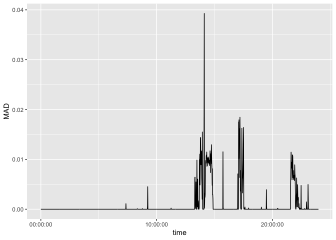

All code for this document is located at [here](https://raw.githubusercontent.com/muschellij2/osler/master/gt3x_limb_data/index.R).


```r
# remotes::install_github("muschellij2/SummarizedActigraphy")
library(SummarizedActigraphy)
# remotes::install_github("THLfi/read.gt3x")
library(read.gt3x)
library(dplyr)
library(readxl)
library(tidyr)
library(readr)
library(lubridate)
library(kableExtra)
library(corrr)
```

# Data

The data is from @chadwell_kenney_granat_thies_galpin_head_2019.  The figshare project for this data is located at https://springernature.figshare.com/collections/Upper_limb_activity_of_twenty_myoelectric_prosthesis_users_and_twenty_healthy_anatomically_intact_adults_/4457855. The gt3x data is located at https://springernature.figshare.com/articles/Unprocessed_raw_30Hz_acceleration_data_stored_as_gt3x/7946189.  

The whole data can be downloaded from [Figshare](https://springernature.figshare.com/articles/Unprocessed_raw_30Hz_acceleration_data_stored_as_gt3x/7946189) directly or can be downloaded for each gt3x file from the [Duplicated Data Figshare]().

## Data Description

The data consists of 40 subjects, 20 with prostheses, 20 without.  Each wore tri-axial Actigraph watches for 7 days, one on each hand.  The metadata/demographics is located at [Demog Figshare]()


```r
data_dir = tempdir()
```


```r
outfile = here::here("data", "file_info.rds")
if (file.exists(token_file) && !file.exists(outfile)) {
  x = rfigshare::fs_details("11916087")
  
  files = x$files
  files = lapply(files, function(x) {
    as.data.frame(x[c("download_url", "name", "id", "size")],
                  stringsAsFactors = FALSE)
  })
  all_files = dplyr::bind_rows(files)
  readr::write_rds(all_files, outfile)
} else {
  all_files = readr::read_rds(outfile)
}
meta = all_files %>% 
  filter(grepl("Meta", name))
df = all_files %>% 
  filter(grepl("gt3x", name))
df %>% 
  head %>% 
  knitr::kable() %>% 
  kableExtra::kable_styling()
```

<table class="table" style="margin-left: auto; margin-right: auto;">
 <thead>
  <tr>
   <th style="text-align:left;"> download_url </th>
   <th style="text-align:left;"> name </th>
   <th style="text-align:right;"> id </th>
   <th style="text-align:left;"> size </th>
  </tr>
 </thead>
<tbody>
  <tr>
   <td style="text-align:left;"> https://ndownloader.figshare.com/files/21855555 </td>
   <td style="text-align:left;"> AI1_NEO1B41100255_2016-10-17.gt3x.gz </td>
   <td style="text-align:right;"> 21855555 </td>
   <td style="text-align:left;"> 33.59 MB </td>
  </tr>
  <tr>
   <td style="text-align:left;"> https://ndownloader.figshare.com/files/21855558 </td>
   <td style="text-align:left;"> AI1_NEO1F09120035_2016-10-17.gt3x.gz </td>
   <td style="text-align:right;"> 21855558 </td>
   <td style="text-align:left;"> 36.04 MB </td>
  </tr>
  <tr>
   <td style="text-align:left;"> https://ndownloader.figshare.com/files/21855561 </td>
   <td style="text-align:left;"> AI2_NEO1B41100262_2016-10-17.gt3x.gz </td>
   <td style="text-align:right;"> 21855561 </td>
   <td style="text-align:left;"> 39.84 MB </td>
  </tr>
  <tr>
   <td style="text-align:left;"> https://ndownloader.figshare.com/files/21855564 </td>
   <td style="text-align:left;"> AI2_NEO1F16120038_2016-10-17.gt3x.gz </td>
   <td style="text-align:right;"> 21855564 </td>
   <td style="text-align:left;"> 41.67 MB </td>
  </tr>
  <tr>
   <td style="text-align:left;"> https://ndownloader.figshare.com/files/21855567 </td>
   <td style="text-align:left;"> AI3_CLE2B21130054_2017-06-02.gt3x.gz </td>
   <td style="text-align:right;"> 21855567 </td>
   <td style="text-align:left;"> 46.45 MB </td>
  </tr>
  <tr>
   <td style="text-align:left;"> https://ndownloader.figshare.com/files/21855573 </td>
   <td style="text-align:left;"> AI3_CLE2B21130055_2017-06-02.gt3x.gz </td>
   <td style="text-align:right;"> 21855573 </td>
   <td style="text-align:left;"> 44.68 MB </td>
  </tr>
</tbody>
</table>

We need to add the data path so that it's a full file name:


```r
df = df %>% 
  rename(file = name) %>% 
  tidyr::separate(file, into = c("id", "serial", "date"), sep = "_",
                  remove = FALSE) %>% 
  mutate(date = sub(".gt3x.*", "", date)) %>% 
  mutate(date = lubridate::ymd(date)) %>% 
  mutate(group = ifelse(grepl("^PU", basename(file)), 
                        "group_with_prosthesis",
                        "group_without_prosthesis")) %>% 
  mutate(article_id = basename(download_url)) %>% 
  mutate(outfile = file.path(data_dir, group, basename(file)))
df %>% 
  head() %>% 
  knitr::kable() %>% 
  kableExtra::kable_styling()
```

<table class="table" style="margin-left: auto; margin-right: auto;">
 <thead>
  <tr>
   <th style="text-align:left;"> download_url </th>
   <th style="text-align:left;"> file </th>
   <th style="text-align:left;"> id </th>
   <th style="text-align:left;"> serial </th>
   <th style="text-align:left;"> date </th>
   <th style="text-align:left;"> size </th>
   <th style="text-align:left;"> group </th>
   <th style="text-align:left;"> article_id </th>
   <th style="text-align:left;"> outfile </th>
  </tr>
 </thead>
<tbody>
  <tr>
   <td style="text-align:left;"> https://ndownloader.figshare.com/files/21855555 </td>
   <td style="text-align:left;"> AI1_NEO1B41100255_2016-10-17.gt3x.gz </td>
   <td style="text-align:left;"> AI1 </td>
   <td style="text-align:left;"> NEO1B41100255 </td>
   <td style="text-align:left;"> 2016-10-17 </td>
   <td style="text-align:left;"> 33.59 MB </td>
   <td style="text-align:left;"> group_without_prosthesis </td>
   <td style="text-align:left;"> 21855555 </td>
   <td style="text-align:left;"> /Users/johnmuschelli/Dropbox/Projects/upper_limb_gt3x_prosthesis/data/group_without_prosthesis/AI1_NEO1B41100255_2016-10-17.gt3x.gz </td>
  </tr>
  <tr>
   <td style="text-align:left;"> https://ndownloader.figshare.com/files/21855558 </td>
   <td style="text-align:left;"> AI1_NEO1F09120035_2016-10-17.gt3x.gz </td>
   <td style="text-align:left;"> AI1 </td>
   <td style="text-align:left;"> NEO1F09120035 </td>
   <td style="text-align:left;"> 2016-10-17 </td>
   <td style="text-align:left;"> 36.04 MB </td>
   <td style="text-align:left;"> group_without_prosthesis </td>
   <td style="text-align:left;"> 21855558 </td>
   <td style="text-align:left;"> /Users/johnmuschelli/Dropbox/Projects/upper_limb_gt3x_prosthesis/data/group_without_prosthesis/AI1_NEO1F09120035_2016-10-17.gt3x.gz </td>
  </tr>
  <tr>
   <td style="text-align:left;"> https://ndownloader.figshare.com/files/21855561 </td>
   <td style="text-align:left;"> AI2_NEO1B41100262_2016-10-17.gt3x.gz </td>
   <td style="text-align:left;"> AI2 </td>
   <td style="text-align:left;"> NEO1B41100262 </td>
   <td style="text-align:left;"> 2016-10-17 </td>
   <td style="text-align:left;"> 39.84 MB </td>
   <td style="text-align:left;"> group_without_prosthesis </td>
   <td style="text-align:left;"> 21855561 </td>
   <td style="text-align:left;"> /Users/johnmuschelli/Dropbox/Projects/upper_limb_gt3x_prosthesis/data/group_without_prosthesis/AI2_NEO1B41100262_2016-10-17.gt3x.gz </td>
  </tr>
  <tr>
   <td style="text-align:left;"> https://ndownloader.figshare.com/files/21855564 </td>
   <td style="text-align:left;"> AI2_NEO1F16120038_2016-10-17.gt3x.gz </td>
   <td style="text-align:left;"> AI2 </td>
   <td style="text-align:left;"> NEO1F16120038 </td>
   <td style="text-align:left;"> 2016-10-17 </td>
   <td style="text-align:left;"> 41.67 MB </td>
   <td style="text-align:left;"> group_without_prosthesis </td>
   <td style="text-align:left;"> 21855564 </td>
   <td style="text-align:left;"> /Users/johnmuschelli/Dropbox/Projects/upper_limb_gt3x_prosthesis/data/group_without_prosthesis/AI2_NEO1F16120038_2016-10-17.gt3x.gz </td>
  </tr>
  <tr>
   <td style="text-align:left;"> https://ndownloader.figshare.com/files/21855567 </td>
   <td style="text-align:left;"> AI3_CLE2B21130054_2017-06-02.gt3x.gz </td>
   <td style="text-align:left;"> AI3 </td>
   <td style="text-align:left;"> CLE2B21130054 </td>
   <td style="text-align:left;"> 2017-06-02 </td>
   <td style="text-align:left;"> 46.45 MB </td>
   <td style="text-align:left;"> group_without_prosthesis </td>
   <td style="text-align:left;"> 21855567 </td>
   <td style="text-align:left;"> /Users/johnmuschelli/Dropbox/Projects/upper_limb_gt3x_prosthesis/data/group_without_prosthesis/AI3_CLE2B21130054_2017-06-02.gt3x.gz </td>
  </tr>
  <tr>
   <td style="text-align:left;"> https://ndownloader.figshare.com/files/21855573 </td>
   <td style="text-align:left;"> AI3_CLE2B21130055_2017-06-02.gt3x.gz </td>
   <td style="text-align:left;"> AI3 </td>
   <td style="text-align:left;"> CLE2B21130055 </td>
   <td style="text-align:left;"> 2017-06-02 </td>
   <td style="text-align:left;"> 44.68 MB </td>
   <td style="text-align:left;"> group_without_prosthesis </td>
   <td style="text-align:left;"> 21855573 </td>
   <td style="text-align:left;"> /Users/johnmuschelli/Dropbox/Projects/upper_limb_gt3x_prosthesis/data/group_without_prosthesis/AI3_CLE2B21130055_2017-06-02.gt3x.gz </td>
  </tr>
</tbody>
</table>


## Demographics data


```r
metadata = file.path(data_dir, "Metadata.xlsx")
if (!file.exists(metadata)) {
  out = download.file(meta$download_url, destfile = metadata)
}
meta = readxl::read_excel(metadata)
```

```
New names:
* `` -> ...5
* `` -> ...11
* `` -> ...12
* `` -> ...13
* `` -> ...14
* ...
```

```r
bad_col = grepl("^\\.\\.", colnames(meta))
colnames(meta)[bad_col] = NA
potential_headers = rbind(colnames(meta), meta[1:2, ])
potential_headers = apply(potential_headers, 2, function(x) {
  x = paste(na.omit(x), collapse = "")
  x = sub(" .csv", ".csv", x)
  x = sub(" .wav", ".wav", x)
  x = gsub(" ", "_", x)
  x
})
colnames(meta) = potential_headers
meta = meta[-c(1:2),]
meta = meta %>% 
  rename(id = Participant_Identifier)
meta = meta %>% 
  filter(!is.na(id),
         id != "Participant Identifier") %>% 
  mutate_all(.funs = function(x) gsub("ü", "yes", x))
meta = meta %>% 
  mutate_at(
    .vars = vars(
      Age,
      `Time_since_prescription_of_a_myoelectric_prosthesis_(years)`
    ),
    readr::parse_number
  ) 
meta = meta %>% 
  mutate( `Time_since_limb_loss_(years)` = ifelse(
    `Time_since_limb_loss_(years)` == "Congenital", 0,
    `Time_since_limb_loss_(years)`)
  )
meta %>% 
  head %>% 
  knitr::kable() %>% 
  kableExtra::kable_styling()
```

<table class="table" style="margin-left: auto; margin-right: auto;">
 <thead>
  <tr>
   <th style="text-align:left;"> id </th>
   <th style="text-align:left;"> Gender </th>
   <th style="text-align:right;"> Age </th>
   <th style="text-align:left;"> Absence_side_(*previously_dominant) </th>
   <th style="text-align:left;"> Sensor_type </th>
   <th style="text-align:left;"> Right_Sensor </th>
   <th style="text-align:left;"> Left_Sensor </th>
   <th style="text-align:left;"> Time_since_limb_loss_(years) </th>
   <th style="text-align:right;"> Time_since_prescription_of_a_myoelectric_prosthesis_(years) </th>
   <th style="text-align:left;"> DataRAW_.gt3x </th>
   <th style="text-align:left;"> RAW.csv </th>
   <th style="text-align:left;"> RAW.wav </th>
   <th style="text-align:left;"> Without_Low_Frequency_Extension60s.csv </th>
   <th style="text-align:left;"> 1s.csv </th>
   <th style="text-align:left;"> With_Low_Frequency_Extension60sLFE.csv </th>
   <th style="text-align:left;"> 1sLFE.csv </th>
   <th style="text-align:left;"> Wear_data.csv </th>
   <th style="text-align:left;"> Sleep_diary.csv </th>
   <th style="text-align:left;"> Prosthesis_Wear_Diary.csv </th>
   <th style="text-align:left;"> Sensor_Wear_Diary.csv </th>
  </tr>
 </thead>
<tbody>
  <tr>
   <td style="text-align:left;"> PU1 </td>
   <td style="text-align:left;"> M </td>
   <td style="text-align:right;"> 45 </td>
   <td style="text-align:left;"> R </td>
   <td style="text-align:left;"> GT3X+ </td>
   <td style="text-align:left;"> NEO1F16120038 </td>
   <td style="text-align:left;"> NEO1F09120035 </td>
   <td style="text-align:left;"> 0 </td>
   <td style="text-align:right;"> 1.5 </td>
   <td style="text-align:left;"> yes </td>
   <td style="text-align:left;"> yes </td>
   <td style="text-align:left;"> yes </td>
   <td style="text-align:left;"> yes </td>
   <td style="text-align:left;"> yes </td>
   <td style="text-align:left;"> yes </td>
   <td style="text-align:left;"> yes </td>
   <td style="text-align:left;"> yes </td>
   <td style="text-align:left;"> yes </td>
   <td style="text-align:left;"> yes </td>
   <td style="text-align:left;"> yes </td>
  </tr>
  <tr>
   <td style="text-align:left;"> PU2 </td>
   <td style="text-align:left;"> M </td>
   <td style="text-align:right;"> 44 </td>
   <td style="text-align:left;"> L </td>
   <td style="text-align:left;"> GT3X+ </td>
   <td style="text-align:left;"> NEO1B41100262 </td>
   <td style="text-align:left;"> NEO1B41100255 </td>
   <td style="text-align:left;"> 0 </td>
   <td style="text-align:right;"> 35.0 </td>
   <td style="text-align:left;"> yes </td>
   <td style="text-align:left;"> yes </td>
   <td style="text-align:left;"> yes </td>
   <td style="text-align:left;"> yes </td>
   <td style="text-align:left;"> yes </td>
   <td style="text-align:left;"> yes </td>
   <td style="text-align:left;"> yes </td>
   <td style="text-align:left;"> yes </td>
   <td style="text-align:left;"> yes </td>
   <td style="text-align:left;"> yes </td>
   <td style="text-align:left;"> yes </td>
  </tr>
  <tr>
   <td style="text-align:left;"> PU3 </td>
   <td style="text-align:left;"> M </td>
   <td style="text-align:right;"> 56 </td>
   <td style="text-align:left;"> R </td>
   <td style="text-align:left;"> wGT3X+ </td>
   <td style="text-align:left;"> CLE2B21130054 </td>
   <td style="text-align:left;"> CLE2B21130055 </td>
   <td style="text-align:left;"> 22 </td>
   <td style="text-align:right;"> 17.0 </td>
   <td style="text-align:left;"> yes </td>
   <td style="text-align:left;"> yes </td>
   <td style="text-align:left;"> yes </td>
   <td style="text-align:left;"> yes </td>
   <td style="text-align:left;"> yes </td>
   <td style="text-align:left;"> yes </td>
   <td style="text-align:left;"> yes </td>
   <td style="text-align:left;"> yes </td>
   <td style="text-align:left;"> yes </td>
   <td style="text-align:left;"> yes </td>
   <td style="text-align:left;"> yes </td>
  </tr>
  <tr>
   <td style="text-align:left;"> PU4 </td>
   <td style="text-align:left;"> M </td>
   <td style="text-align:right;"> 61 </td>
   <td style="text-align:left;"> R* </td>
   <td style="text-align:left;"> GT3X+ </td>
   <td style="text-align:left;"> NEO1F09120034 </td>
   <td style="text-align:left;"> NEO1B41100262 </td>
   <td style="text-align:left;"> 37 </td>
   <td style="text-align:right;"> 28.0 </td>
   <td style="text-align:left;"> yes </td>
   <td style="text-align:left;"> yes </td>
   <td style="text-align:left;"> yes </td>
   <td style="text-align:left;"> yes </td>
   <td style="text-align:left;"> yes </td>
   <td style="text-align:left;"> yes </td>
   <td style="text-align:left;"> yes </td>
   <td style="text-align:left;"> yes </td>
   <td style="text-align:left;"> yes </td>
   <td style="text-align:left;"> yes </td>
   <td style="text-align:left;"> Incomplete </td>
  </tr>
  <tr>
   <td style="text-align:left;"> PU5 </td>
   <td style="text-align:left;"> F </td>
   <td style="text-align:right;"> 18 </td>
   <td style="text-align:left;"> L </td>
   <td style="text-align:left;"> GT3X+ </td>
   <td style="text-align:left;"> NEO1F16120038 </td>
   <td style="text-align:left;"> NEO1F09120035 </td>
   <td style="text-align:left;"> 0 </td>
   <td style="text-align:right;"> 10.0 </td>
   <td style="text-align:left;"> yes </td>
   <td style="text-align:left;"> yes </td>
   <td style="text-align:left;"> yes </td>
   <td style="text-align:left;"> yes </td>
   <td style="text-align:left;"> yes </td>
   <td style="text-align:left;"> yes </td>
   <td style="text-align:left;"> yes </td>
   <td style="text-align:left;"> yes </td>
   <td style="text-align:left;"> Incomplete </td>
   <td style="text-align:left;"> Incomplete </td>
   <td style="text-align:left;"> yes </td>
  </tr>
  <tr>
   <td style="text-align:left;"> PU6 </td>
   <td style="text-align:left;"> M </td>
   <td style="text-align:right;"> 51 </td>
   <td style="text-align:left;"> L </td>
   <td style="text-align:left;"> wGT3X+ </td>
   <td style="text-align:left;"> CLE2B21130054 </td>
   <td style="text-align:left;"> CLE2B21130055 </td>
   <td style="text-align:left;"> 0 </td>
   <td style="text-align:right;"> 30.0 </td>
   <td style="text-align:left;"> yes </td>
   <td style="text-align:left;"> yes </td>
   <td style="text-align:left;"> yes </td>
   <td style="text-align:left;"> yes </td>
   <td style="text-align:left;"> yes </td>
   <td style="text-align:left;"> yes </td>
   <td style="text-align:left;"> yes </td>
   <td style="text-align:left;"> yes </td>
   <td style="text-align:left;"> yes </td>
   <td style="text-align:left;"> yes </td>
   <td style="text-align:left;"> Incomplete </td>
  </tr>
</tbody>
</table>

# Packages

THe `read.gt3x` and `AGread` packages can read gt3x files, but only the `read.gt3x` package can read in the old GT3X format from NHANES 2003-2006.  Thus, we will use that package to read the `gt3x` format.  If you need additional information, such as temperature, lux, etc, you may want to try `AGread::read_gt3x`.  Additionally, the `read.gt3x` package can read in `gt3x` files that have been zipped, including gzipped (extension `gz`), bzipped (`bz2`), or xzipped (`xz`).

THe `SummarizedActigraphy::read_actigraphy` wraps the `read.gt3x` functionality, and puts the output format to the `AccData` format, which is common in the `GGIR` package.  The `read_actigraphy` also tries to read other formats, by using `GGIR::g.readaccfile` and other `GGIR` functionality.  


```r
data = full_join(meta, df)
```

```
Joining, by = "id"
```

## Read in one file


Here we will read in one file:


```r
iid = sample(nrow(df), 1)
idf = df[iid, ]
if (!file.exists(idf$outfile)) {
  out = curl::curl_download(idf$download_url, destfile = idf$outfile)
}
# acc = read.gt3x(idf$outfile, verbose = FALSE, 
#                 asDataFrame = TRUE, imputeZeroes = TRUE)
acc = read_actigraphy(idf$outfile, verbose = FALSE)
head(acc$data.out)
```

```
Sampling Rate: 30Hz
Firmware Version: 3.2.1
Serial Number Prefix: NEO
       X      Y      Z                time
1 -0.021 -0.683 -0.762 2017-03-24 16:30:00
2 -0.003 -0.625 -0.736 2017-03-24 16:30:00
3  0.003 -0.601 -0.765 2017-03-24 16:30:00
4 -0.003 -0.630 -0.806 2017-03-24 16:30:00
5 -0.015 -0.630 -0.821 2017-03-24 16:30:00
6 -0.012 -0.639 -0.789 2017-03-24 16:30:00
```

```r
options(digits.secs = 2)
head(acc$data.out)
```

```
Sampling Rate: 30Hz
Firmware Version: 3.2.1
Serial Number Prefix: NEO
       X      Y      Z                   time
1 -0.021 -0.683 -0.762 2017-03-24 16:30:00.00
2 -0.003 -0.625 -0.736 2017-03-24 16:30:00.02
3  0.003 -0.601 -0.765 2017-03-24 16:30:00.06
4 -0.003 -0.630 -0.806 2017-03-24 16:30:00.09
5 -0.015 -0.630 -0.821 2017-03-24 16:30:00.13
6 -0.012 -0.639 -0.789 2017-03-24 16:30:00.17
```

```r
acc$freq
```

```
[1] 30
```

Let's look at the number of measurements per second to see the true sampling rate:


```r
res = acc$data.out %>% 
  mutate(dt = floor_date(time, "seconds")) %>% 
  group_by(dt) %>% 
  count()
table(res$n)
```

```

    30 
604800 
```

# Plot the data


```r
library(ggplot2)
res = acc$data.out %>% 
  mutate(day = floor_date(time, "day"),
         time = hms::as_hms(time)) %>% 
  mutate(day = difftime(day, day[1], units = "days")) 
res = res %>%
  filter(day == 1)
res = res %>% 
  filter(between(time, 
                 hms::as_hms("10:00:00"),
                 hms::as_hms("10:30:00"))
         ) 
```

```
Warning: between() called on numeric vector with S3 class
```

```r
res = res %>% 
  tidyr::gather(key = direction, value = accel, -time, -day)

res %>%
  ggplot(aes(x = time, y = accel, colour = direction)) +
  geom_line() +
  theme(
  legend.background = element_rect(
    fill = "transparent"),
  legend.position = c(0.5, 0.9),
  legend.direction = "horizontal",
  legend.key = element_rect(fill = "transparent", 
                            color = "transparent") ) 
```

<!-- -->


```r
check_zeros = function(df) {
  any(rowSums(df[, c("X", "Y", "Z")] == 0) == 3)
}
fix_zeros = function(df, fill_in = TRUE) {
  zero = rowSums(df[, c("X", "Y", "Z")] == 0) == 3
  names(zero) = NULL
  df$X[zero] = NA
  df$Y[zero] = NA
  df$Z[zero] = NA
  if (fill_in) {
    df$X = zoo::na.locf(df$X, na.rm = FALSE)
    df$Y = zoo::na.locf(df$Y, na.rm = FALSE)
    df$Z = zoo::na.locf(df$Z, na.rm = FALSE)
    
    df$X[ is.na(df$X)] = 0
    df$Y[ is.na(df$Y)] = 0
    df$Z[ is.na(df$Z)] = 0
  }
  df
}
```

# Simple Data Checks

Here we can do a simple data check:

```r
acc$header
```

```
# A tibble: 21 x 2
   Field            Value              
   <chr>            <chr>              
 1 Serial Number    NEO1F09120035      
 2 Device Type      GT3XPlus           
 3 Firmware         3.2.1              
 4 Battery Voltage  4.02               
 5 Sample Rate      30                 
 6 Start Date       2017-03-24 16:30:00
 7 Stop Date        2017-03-31 16:30:00
 8 Last Sample Time 2017-03-31 16:30:00
 9 TimeZone         01:00:00           
10 Download Date    2017-04-11 13:12:29
# … with 11 more rows
```

```r
acc$header %>% 
  filter(Field %in% c("Sex", "Age", "Side"))
```

```
# A tibble: 2 x 2
  Field Value 
  <chr> <chr> 
1 Sex   Female
2 Side  Left  
```

```r
data[iid, c("Gender", "Age")]
```

```
# A tibble: 1 x 2
  Gender   Age
  <chr>  <dbl>
1 F         24
```

## Calculate Activity Measures


```r
calculate_ai = function(df, epoch = "1 min") {
  sec_df = df %>% 
    mutate(
      HEADER_TIME_STAMP = lubridate::floor_date(HEADER_TIME_STAMP, "1 sec")) %>% 
    group_by(HEADER_TIME_STAMP) %>% 
    summarise(
      AI = sqrt((var(X) + var(Y) + var(Z))/3),
    )
  sec_df %>% mutate(
    HEADER_TIME_STAMP = lubridate::floor_date(HEADER_TIME_STAMP, epoch)) %>% 
    group_by(HEADER_TIME_STAMP) %>% 
    summarise(
      AI = sum(AI)
    )
}

calculate_mad = function(df, epoch = "1 min") {
  df %>% 
    mutate(         
      r = sqrt(X^2+Y^2+Z^2),
      HEADER_TIME_STAMP = lubridate::floor_date(HEADER_TIME_STAMP, epoch)) %>% 
    group_by(HEADER_TIME_STAMP) %>% 
    summarise(
      SD = sd(r),
      MAD = mean(abs(r - mean(r))),
      MEDAD = median(abs(r - mean(r)))
    )
}

calculate_measures = function(df, epoch = "1 min") {
  ai0 = calculate_ai(df, epoch = epoch)
  mad = calculate_mad(df, epoch = epoch)
  res = full_join(ai0, mad)
  res
}
```

## Idle Sleep Mode

As the `imputeZeros` function in `read.gt3x` puts zeros for the idle sleep mode in ActiGraph, we need to repeat the measure to mimic the ActiGraph software:


```r
df = acc$data.out
df = df %>% 
  rename(HEADER_TIME_STAMP = time) %>% 
  select(HEADER_TIME_STAMP, X, Y, Z)
zero_rows = rowSums(df[, c("X", "Y", "Z")] == 0) == 3
any(zero_rows)
```

```
[1] TRUE
```

```r
ind = unname(which(zero_rows))
ind = head(ind)
ind = c(min(ind) - (1:5), ind)
as.data.frame(df[ind,])
```

```
           HEADER_TIME_STAMP      X      Y      Z
25920 2017-03-24 16:44:23.97 -0.196 -0.636 -0.748
25919 2017-03-24 16:44:23.93 -0.194 -0.639 -0.745
25918 2017-03-24 16:44:23.90 -0.196 -0.642 -0.751
25917 2017-03-24 16:44:23.86 -0.196 -0.639 -0.748
25916 2017-03-24 16:44:23.82 -0.196 -0.639 -0.748
25921 2017-03-24 16:44:24.00  0.000  0.000  0.000
25922 2017-03-24 16:44:24.02  0.000  0.000  0.000
25923 2017-03-24 16:44:24.06  0.000  0.000  0.000
25924 2017-03-24 16:44:24.09  0.000  0.000  0.000
25925 2017-03-24 16:44:24.13  0.000  0.000  0.000
25926 2017-03-24 16:44:24.17  0.000  0.000  0.000
```

```r
df = fix_zeros(df)
as.data.frame(df[ind,])
```

```
           HEADER_TIME_STAMP      X      Y      Z
25920 2017-03-24 16:44:23.97 -0.196 -0.636 -0.748
25919 2017-03-24 16:44:23.93 -0.194 -0.639 -0.745
25918 2017-03-24 16:44:23.90 -0.196 -0.642 -0.751
25917 2017-03-24 16:44:23.86 -0.196 -0.639 -0.748
25916 2017-03-24 16:44:23.82 -0.196 -0.639 -0.748
25921 2017-03-24 16:44:24.00 -0.196 -0.636 -0.748
25922 2017-03-24 16:44:24.02 -0.196 -0.636 -0.748
25923 2017-03-24 16:44:24.06 -0.196 -0.636 -0.748
25924 2017-03-24 16:44:24.09 -0.196 -0.636 -0.748
25925 2017-03-24 16:44:24.13 -0.196 -0.636 -0.748
25926 2017-03-24 16:44:24.17 -0.196 -0.636 -0.748
```
We may want to remove these rows, but we're trying to mimic ActiGraph output.  Now we can calculate a set of "measures" that are estimates of activity.  Those include AI, MAD, and SD.  I have re-implemented the method from the `ActivityIndex` package, with the restriction that no estimate of $\sigma_0$ is given, which is the estimate of the standard deviation when the device is at rest. We see, even for a relatively large number of values, it is pretty quick to compute:


```r
system.time({measures = calculate_measures(df)})
```

```
`summarise()` ungrouping output (override with `.groups` argument)
`summarise()` ungrouping output (override with `.groups` argument)
`summarise()` ungrouping output (override with `.groups` argument)
```

```
Joining, by = "HEADER_TIME_STAMP"
```

```
   user  system elapsed 
 46.605   5.001  56.325 
```

### MIMS Units

We will calculate MIMS units with the `MIMSunit` package:


```r
library(MIMSunit)
hdr = acc$header %>% 
  filter(Field %in% c("Acceleration Min", "Acceleration Max")) %>% 
  mutate(Value = as.numeric(Value))
dynamic_range = range(hdr$Value)
system.time({
  mims = df %>% 
    mims_unit(epoch = "1 min", 
              dynamic_range = dynamic_range)
})
```

```
================================
```

```
Warning: `tbl_df()` is deprecated as of dplyr 1.0.0.
Please use `tibble::as_tibble()` instead.
This warning is displayed once every 8 hours.
Call `lifecycle::last_warnings()` to see where this warning was generated.
```

```
================================================
```

```
    user   system  elapsed 
 645.443  236.380 1085.030 
```

```r
measures = full_join(measures, mims)
```

```
Joining, by = "HEADER_TIME_STAMP"
```


### Correlation of Measures

We can show the correlation of the measures with the others, noting that some of these have very high correlation.


```r
library(corrr)
measures %>% 
  select(-HEADER_TIME_STAMP) %>% 
  correlate() %>% 
  stretch(remove.dups = TRUE, na.rm = TRUE) %>% 
  arrange(desc(r))
```

```

Correlation method: 'pearson'
Missing treated using: 'pairwise.complete.obs'
```

```
# A tibble: 10 x 3
   x     y             r
   <chr> <chr>     <dbl>
 1 AI    MIMS_UNIT 0.995
 2 AI    SD        0.986
 3 SD    MAD       0.979
 4 SD    MIMS_UNIT 0.975
 5 AI    MAD       0.972
 6 MAD   MEDAD     0.971
 7 MAD   MIMS_UNIT 0.954
 8 SD    MEDAD     0.909
 9 AI    MEDAD     0.905
10 MEDAD MIMS_UNIT 0.880
```


# Average Day 

Now we can create an average day profile.  We will calculate the mean value of these functions for each minute separately:

```r
to_minute = function(x) {
  x = format(x, "%H:%M:%S")
  x = hms::as_hms(x)
  x
}
average_day = measures %>% 
  mutate(HEADER_TIME_STAMP = to_minute(HEADER_TIME_STAMP)) %>% 
  group_by(HEADER_TIME_STAMP) %>% 
  summarise_at(vars(AI, SD, MAD, MEDAD), mean, na.rm = TRUE)
average_day %>%
  ggplot(aes(x = HEADER_TIME_STAMP, y = AI)) +
  geom_line()
```

<!-- -->

```r
average_day %>%
  ggplot(aes(x = HEADER_TIME_STAMP, y = MAD)) +
  geom_line()
```

<!-- -->

## 1440 Format 

We can also make the data 1440 format:


```r
measures1440 = measures %>% 
  select(HEADER_TIME_STAMP, AI) %>% 
  mutate(
    date = lubridate::as_date(HEADER_TIME_STAMP),
    HEADER_TIME_STAMP = to_minute(HEADER_TIME_STAMP)) %>% 
  mutate(HEADER_TIME_STAMP = sprintf("MIN_%04.0f", as.numeric(HEADER_TIME_STAMP)/60)) %>% 
  spread(HEADER_TIME_STAMP, value = AI)
head(measures1440)
```

```
# A tibble: 6 x 1,441
  date       MIN_0000 MIN_0001 MIN_0002 MIN_0003 MIN_0004 MIN_0005 MIN_0006
  <date>        <dbl>    <dbl>    <dbl>    <dbl>    <dbl>    <dbl>    <dbl>
1 2017-03-24       NA       NA       NA       NA   NA        NA          NA
2 2017-03-25        0        0        0        0    0.476     2.03        0
3 2017-03-26        0        0        0        0    0         0           0
4 2017-03-27        0        0        0        0    0         0           0
5 2017-03-28        0        0        0        0    0         0           0
6 2017-03-29        0        0        0        0    0         0           0
# … with 1,433 more variables: MIN_0007 <dbl>, MIN_0008 <dbl>, MIN_0009 <dbl>,
#   MIN_0010 <dbl>, MIN_0011 <dbl>, MIN_0012 <dbl>, MIN_0013 <dbl>,
#   MIN_0014 <dbl>, MIN_0015 <dbl>, MIN_0016 <dbl>, MIN_0017 <dbl>,
#   MIN_0018 <dbl>, MIN_0019 <dbl>, MIN_0020 <dbl>, MIN_0021 <dbl>,
#   MIN_0022 <dbl>, MIN_0023 <dbl>, MIN_0024 <dbl>, MIN_0025 <dbl>,
#   MIN_0026 <dbl>, MIN_0027 <dbl>, MIN_0028 <dbl>, MIN_0029 <dbl>,
#   MIN_0030 <dbl>, MIN_0031 <dbl>, MIN_0032 <dbl>, MIN_0033 <dbl>,
#   MIN_0034 <dbl>, MIN_0035 <dbl>, MIN_0036 <dbl>, MIN_0037 <dbl>,
#   MIN_0038 <dbl>, MIN_0039 <dbl>, MIN_0040 <dbl>, MIN_0041 <dbl>,
#   MIN_0042 <dbl>, MIN_0043 <dbl>, MIN_0044 <dbl>, MIN_0045 <dbl>,
#   MIN_0046 <dbl>, MIN_0047 <dbl>, MIN_0048 <dbl>, MIN_0049 <dbl>,
#   MIN_0050 <dbl>, MIN_0051 <dbl>, MIN_0052 <dbl>, MIN_0053 <dbl>,
#   MIN_0054 <dbl>, MIN_0055 <dbl>, MIN_0056 <dbl>, MIN_0057 <dbl>,
#   MIN_0058 <dbl>, MIN_0059 <dbl>, MIN_0060 <dbl>, MIN_0061 <dbl>,
#   MIN_0062 <dbl>, MIN_0063 <dbl>, MIN_0064 <dbl>, MIN_0065 <dbl>,
#   MIN_0066 <dbl>, MIN_0067 <dbl>, MIN_0068 <dbl>, MIN_0069 <dbl>,
#   MIN_0070 <dbl>, MIN_0071 <dbl>, MIN_0072 <dbl>, MIN_0073 <dbl>,
#   MIN_0074 <dbl>, MIN_0075 <dbl>, MIN_0076 <dbl>, MIN_0077 <dbl>,
#   MIN_0078 <dbl>, MIN_0079 <dbl>, MIN_0080 <dbl>, MIN_0081 <dbl>,
#   MIN_0082 <dbl>, MIN_0083 <dbl>, MIN_0084 <dbl>, MIN_0085 <dbl>,
#   MIN_0086 <dbl>, MIN_0087 <dbl>, MIN_0088 <dbl>, MIN_0089 <dbl>,
#   MIN_0090 <dbl>, MIN_0091 <dbl>, MIN_0092 <dbl>, MIN_0093 <dbl>,
#   MIN_0094 <dbl>, MIN_0095 <dbl>, MIN_0096 <dbl>, MIN_0097 <dbl>,
#   MIN_0098 <dbl>, MIN_0099 <dbl>, MIN_0100 <dbl>, MIN_0101 <dbl>,
#   MIN_0102 <dbl>, MIN_0103 <dbl>, MIN_0104 <dbl>, MIN_0105 <dbl>,
#   MIN_0106 <dbl>, …
```


# References
